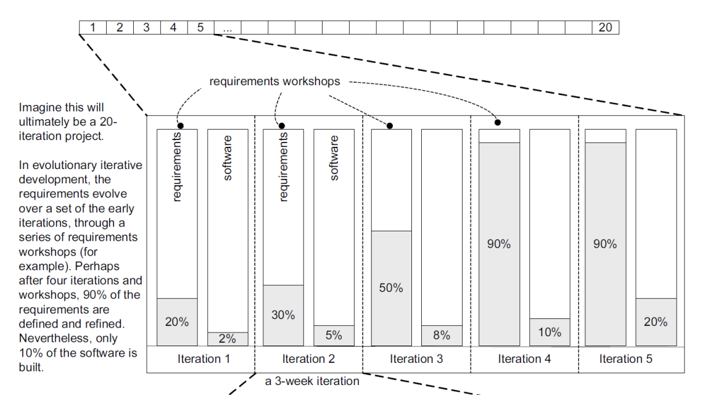
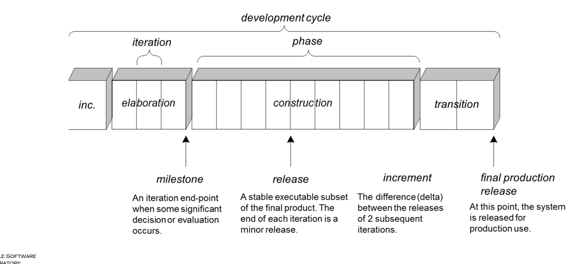
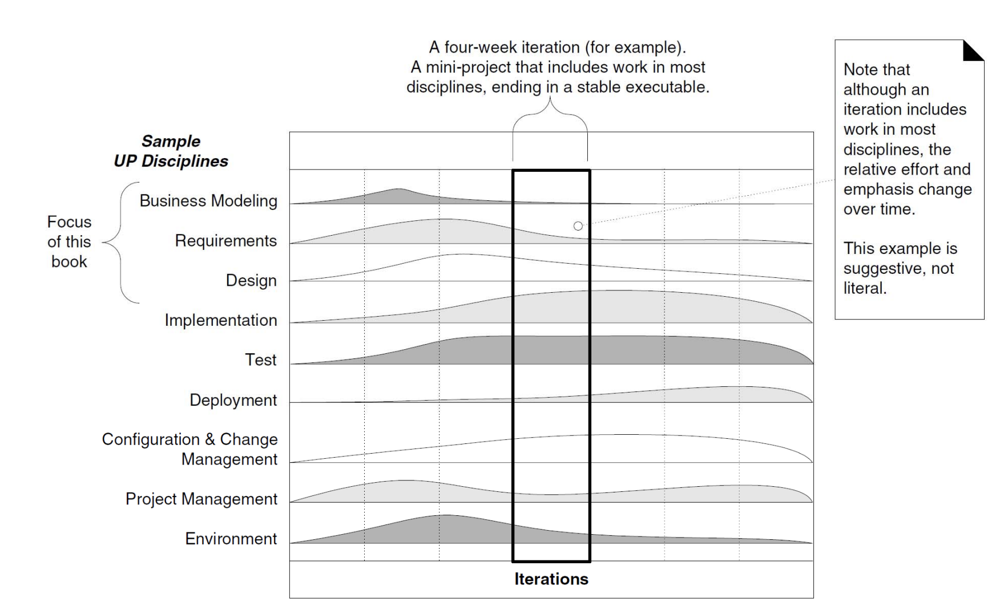
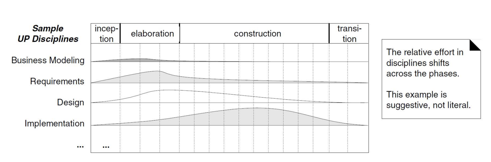
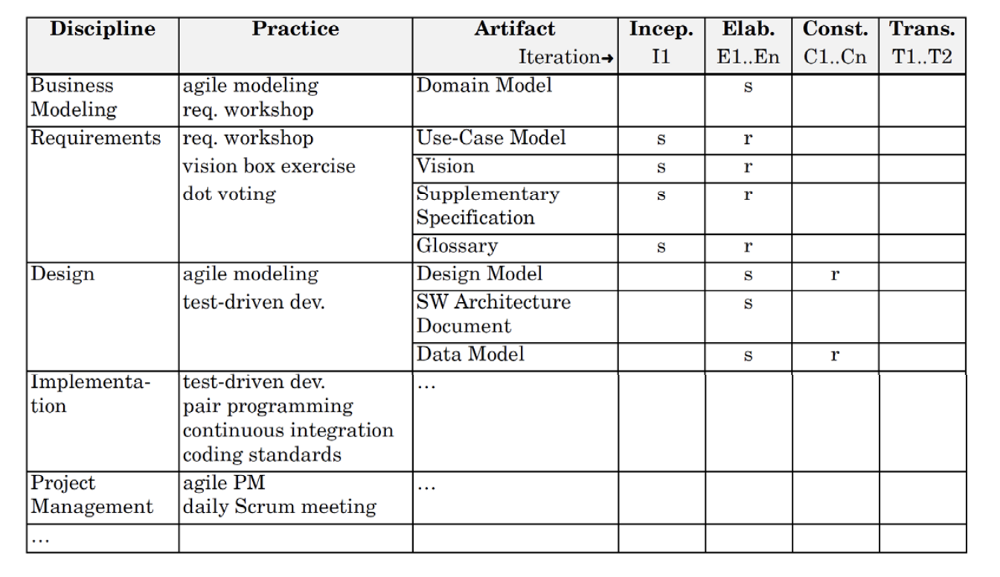

# Chapter 2.Iterative, Evolutionary, and Agile

## Software Development Process and the UP

- 소프트웨어 개발 프로세스
  - 소프트웨어 개발 프로세스는 소프트웨어를 체계적으로 만들고, 배포하며, 때때로 유지보수하는 방법론을 말한다.
- 통합 프로세스 (UP: Unified Process)
  - UP는 객체지향 시스템을 만들기 위한 popular한 반복적인 소프트웨어 개발 프로세스
  - 고정된 길이의 반복(약 3주 간의 미니 워터폴)을 가진 반복적인 프로세스
  - 애자일 방법론에서 영감을 받았으며(즉, 워터폴 방법론과는 반대), 유연성을 갖고 다른 객체지향 프로세스와 결합될 수 있다.
  - 객체지향 소프트웨어 개발을 위한 사실상의 산업 표준

> "미니 워터폴"은 각 반복 주기에서 전체 워터폴 모델(계획, 설계, 구현, 테스트)을 소규모로 실행하는 것을 의미

## Risk-Driven and Client-Driven Iterative Planning

- 통합 프로세스(UP)는 위험 기반과 고객 중심의 반복적인 계획을 결합할 것을 권장한다. 
- Risk-Driven
  - 프로젝트에서 발생할 수 있는 `위험 요소들을 초기에 식별하고, 이를 관리하며 최소화`하는 것에 중점을 둔다.
  - `개발 초기에 가장 큰 위험을 가진 부분을 우선적으로 처리하여, 나중에 발생할 수 있는 문제를 미리 방지`한다.
  - 위험을 줄이기 위해 프로젝트의 가장 `불확실한 부분을 먼저 해결`하여 프로젝트 실패의 가능성을 줄인다.
  - 그리고 Risk-Driven한 반복적 개발은 가장 큰 위험을 가진 부분을 우선적으로 처리하기 위해 architecture-centric한 
  반복적 개발을 한다. 즉, 아키텍쳐를 초기 개발 단계에서 처리한다.
- Client-Driven
  - 고객이 가장 중요하게 생각하는 기능을 구축한다.
- architecture-centric iterative development
  - 소프트웨어의 핵심 아키텍처, 즉 소프트웨어의 기본적인 구조와 설계에 초점을 맞춘다.
  - 초기 반복(개발 주기) 동안에는 시스템의 핵심이 되는 아키텍처를 구축, 테스트하고 이를 안정화시키는 작업에 중점을 둔다.
  - 이를 통해 나머지 개발 과정에서 확장이나 유지보수가 용이하도록 할 수 있다.

> 간단히 말하자면 초기에 아키텍쳐를 잘 구축해 두면, 이후 개발 과정에서 여러 가지 변화에도 유연하게 대응할 수 있고, 프로젝트 전체의
> 리스크를 관리할 수 있게 된다. 이는 개발 초기에 더 많은 시간과 노력을 투입함으로써 장기적으로 프로젝트를 안정적으로 진행할 수 있는
> 기반을 마련하는 전략이다.

- 위의 그림은 전형적인 반복적인 소프트웨어 개발 프로젝트의 예를 보여준다. 
- 여기서 각 반복(iteration)은 일정 기간(예: 3주) 동안 진행되며, 각 반복마다 요구 사항 워크샵을 통해 요구 사항을 점진적으로 발전시키고, 소프트웨어 개발을 단계적으로 진행한다.
- 예를 들어, 첫 번째 반복에서는 전체 요구 사항의 20%와 소프트웨어의 20%를 정의하고 개발할 수 있으며, 이후의 반복에서 요구 사항과 소프트웨어 개발을 점차 완성해 나간다.

## The UP Practices (UP의 실천 방법들)
- UP의 중심 아이디어는 짧은 기간을 두고 반복적(iterative), 진화적(evolutionary) 적응적인(adaptive) 개발을 하는 것이다.
- 최선의 실천 방법들과 주요 개념들
  1. 초기 iterations에서 high-risk and high-value 문제를 해결한다. -> (Risk-driven, Client-driven)
  2. 사용자와 지속적으로 소통하여 평가와 피드백을 받는다. ->  (Client-driven)
  3. 초기 iterations에서 일관성 있고 핵심적인 아키텍처를 구축한다. -> (Architecture-centric)
  4. 지속적으로 품질을 검증하며, 조기에, 자주, 현실적으로 테스트한다.
  5. 적절한 경우 유스 케이스를 적용한다.
  6. 시각적 모델링을 수행한다. (UML을 사용하여)
  7. 요구 사항을 세심하게 manage한다. (구성 관리, configuration management).

## The UP Phases
- UP 프로젝트는 작업과 반복(iteration)을 네 가지 주요 단계로 조직화한다.
  1. 개시(Inception): 프로젝트의 시작 단계로, 프로젝트의 기본 틀을 설정하는 중요한 시기이다. 대략적인 비전, 사업 사례, 범위, 모호한 비용 추정을 포함한다.

  2. 정교화(Elaboration): 프로젝트에서 가장 중요한 구조적 기반과 요구 사항을 세밀하게 다듬고, 프로젝트의 리스크를 최소화하는 작업을 진행하는 단계이다. refined vision, iterative implementation of the core architecture, resolution of high risks, 대부분의 요구 사항 및 범위 식별, 보다 realistic estimates이 이루어진다.

  3. 구축(Construction): 실제로 시스템이나 애플리케이션을 개발하고 완성하는 단계이다. remaining한 더 낮은 위험을 가진 요소들의 iterative implementation 및 배포 준비를 한다.

  4. 전환(Transition): 개발된 시스템을 최종 사용자에게 인도하고, 실제 운영 환경에 배치하는 단계이다. 베타 테스트와 배포를 수행한다.

  

### Inception
- 개시 단계는 프로젝트 시작 시점에서 모든 주요 이해관계자들이 공통의 이해와 합의에 도달하는 데 중점을 두며, 프로젝트의 성공적인 시작을 위한 기반이 된다. 
- 이 단계는 프로젝트가 진행될 가치가 있는지와 프로젝트를 계속 진행할 준비가 되었는지를 결정하는 중요한 결정들을 내리는 시기이다.

### Elaboration
- `이 단계에서의 주요 목표` : 
  1. 핵심 아키텍처 구축: 이 단계에서는 시스템의 핵심이 될 아키텍처를 구축한다. 이 아키텍처는 전체 시스템의 기반으로, 후속 개발의 기준이 되며, 주요 설계 결정과 기술적인 틀을 확립한다.
  2. 위험 감소: 프로젝트의 잠재적 위험을 식별하고 해결하여 향후 단계의 위험을 최소화한다. 이는 비즈니스 요구사항이나 기술적 챌린지를 포함할 수 있다.
  3. 요구사항과 범위 정의: 고객과의 협업을 통해 프로젝트의 요구사항을 구체화하고, 프로젝트 범위를 명확하게 한다.
- `이 세가지 주요 활동을 통해 정교화 단계가 끝나면 다음과 같은 결론이 도출된다.`
  1. 요구사항 안정화: 정교화 단계의 종료 시점에는 고객의 요구사항을 상세히 이해하고 합의에 도달하게 된다. 이는 변경될 가능성이 적은 안정된 요구사항 세트를 의미하며, 프로젝트의 나머지 부분에서는 이러한 요구사항에 기반하여 개발이 진행된다.
  2. 아키텍처 결정: 핵심 아키텍처가 구축되고 테스트되며 안정화되는 과정을 거치면, 이 아키텍처는 변경하기 어렵고 프로젝트의 나머지 기간 동안 유지되어야 하는 기반이 된다. 이는 나중에 큰 비용이나 복잡성 없이 시스템의 확장성과 유지보수성을 보장한다.

### Construction
- 주요 작업
  1. 남은 기능 구현: 정교화(Elaboration) 단계에서 핵심 아키텍처와 가장 중요한 기능들을 구축한 후, 구축 단계에서는 프로젝트 범위에 포함된 나머지 기능들을 개발한다. 이는 종종 리스크가 낮고 상대적으로 이해가 잘 되는 기능들이다.

  2. 시스템 준비: 이 단계에서 개발된 기능들을 통합하고, 전체 시스템으로서의 작동을 보장한다. 또한, 이 단계에서 시스템을 배포할 준비를 하며, 시스템의 성능, 안정성 및 사용자 요구 사항 충족 여부를 평가한다.

  3. 반복적인 개발 및 테스트: 개발 프로세스를 반복하며 지속적으로 시스템을 테스트하고, 사용자 피드백을 통합하고, 이를 바탕으로 추가적인 수정 및 개선을 진행한다.

### Transition
- 핵심 활동

  1. 베타 테스트: 사용자가 실제 환경에서 시스템을 사용하도록 하여, 버그나 사용성 문제를 발견하고 해결한다. 베타 테스트를 통해 실제 운영 환경에서 시스템의 성능을 평가하고 사용자의 피드백을 수집한다.

  2. 배포 준비: 시스템을 사용자에게 전달하기 전에 필요한 최종 준비를 한다. 이에는 사용자 교육, 운영 문서 준비, 마케팅 및 지원 계획 수립 등이 포함될 수 있다.

  3. 실제 배포: 시스템을 생산 환경에 배포하고, 사용자들이 실제로 사용할 수 있도록 한다. 이 과정에서 시스템을 공식적으로 출시하고, 필요한 경우 점진적으로 사용자 베이스를 확대한다

  4. 사용자 지원: 사용자가 시스템을 효과적으로 사용할 수 있도록 지원하고, 발생할 수 있는 운영상의 문제에 대응한다.

  5. 피드백 기반 개선: 사용자로부터 받은 피드백을 기반으로 시스템의 문제점을 개선하고, 필요한 경우 추가 기능을 개발한다.

## The UP Disciplines

- UP에서는 프로젝트를 여러 작은 단위의 iteration으로 나누고, 각 iteration은 일종의 미니 프로젝트처럼 모든 계발 단계를 포함한다.
- 이 그래프는 하나의 iteration 동안 다양한 규율(Disciplines)에 들어가는 노력이 어떻게 변화하는 지를 시각적으로 보여준다.
- 예를 들어, 4주 간의 iteration이라고 가정하면 이 iteration은 일종의 미니 프로젝트처럼 모든 계발 단계를 포함하며 각 iteration은 안정적으로 실행 가능한 결과물로 끝난다.
- 이 4주는 각 iteration이 시작되고 끝나는 전체 기간을 의미하며, 이 기간 동안 프로젝트 팀은 계획된 일련의 활동 (요구사항 분석, 설계, 구현, 테스트 등)을 완수한다.
- Disciplines에 대한 설명
  - Business Modeling : 프로젝트가 어떻게 비즈니스 목표에 부합하는지 이해하고 설명하는 활동
  - Requirements : 프로젝트의 요구사항을 식별하고 정의하는 과정
  - Design : 시스템의 구조와 구성요소를 설계하는 단계
  - Implementation : 실제 코드를 작성하고 시스템을 구축하는 활동
  - Test : 코드가 제대로 동작하는지 확인한기 위한 검증 과정
  - Deployment : 완성된 소프트웨어를 사용자에게 전달하고 실제 환경에 설치하는 작업
  - Configuration & Change Management : 소프트웨어의 버전을 관리하고 변경사항을 추적하는 활동
  - Project Management : 일정, 예산, 자원 등 프로젝트의 전반적인 관리를 말한다.
  - Environment : 개발, 테스트, 배포 등을 위한 인프라와 도구의 설정과 유지 관리를 포함한다.

## Relationship Between the Disciplines and Phases

- 이 그림은 UP에서 프로젝트의 다양한 단계(inception, elaboration, construction, transition)에 걸쳐서 각 Disciplines(비즈니스 모델링, 요구사항, 설계, 구현 등)에 투입되는 상대적인 노력이 어떻게 변화하는지를 보여준다.
  - Inception단계에서는 비즈니스 모델링과 요구사항 수집에 많은 노력을 할애한다.
  - Elaboration단계에서는 설계와 요구사항 정의에 더 많은 노력을 할애하며, Artifact를 상세화하고 리스크를 해소한다.
  - Construction단계에서는 주로 구현과 테스트에 노력이 집중되어 실제 제품을 만들어낸다.
  - Transition단계에서는 시스템 배포와 최종 사용자에 대한 지원에 더 많은 노력을 기울인다.

- 용어 정리
  - `Artifact` : 작업 결과물을 의미하는 일반적인 용어로, 코드, 웹 그래픽, DB 스키마, 텍스트 문서, 다이어그램, 모델 등이 이에 해당한다.
  - `Discipline` : 하나의 주제 영역 내에서 관련된 활동과 아티팩트의 집합을 의미한다. 예를 들어, 요구사항 분석 내의 활동들이 여기에 해당한다.

## The UP Development Case

- 이 그림은 UP의 개발 사례 (Development Case)에 대하여 설명한다.
- 각 Discipline에서 사용하는 Practice는 무엇인지, 어떤 Artifact가 도출되어야 하는지를 문서화 해놓은 것이다.
  - Practice : 각 규율(Discipline)에 해당하는 구체적인 실천 방법을 나타낸다.
  - Artifact : 각 실천 방법에 따라 생성되는 결과물이다. 예를 들어, 요구사항 실천 방법에 따라 'Use-Case Model'이나 'Vision'과 같은 문서가 생성된다. 

- `표 해석하기`
  - 's'로 표시된 것은 해당 단계에서 특정 아티팩트가 주목을 받아 작업이 시작되었음을 의미한다.
  - 'r'(refine)로 표시된 것은 그 단계에서 아티팩트를 정리하거나 수정, 개선하는 작업을 함을 나타낸다. 즉, 해당 단계에서
  아티팩트가 주요한 발전을 이루어야 한다는 것을 뜻한다.
  - 도메인 모델이 Elaboration 단계에서 's'로 시작된 후 뒤에 아무것도 표시되어 있지 않다면, 그 단계에서 도메인 모델링 작업이 중요한 초점을 이루고, 후속 단계에서는 도메인 모델을 기반으로 설계 및 구현 등의 다른 작업이 이루어지지만, 도메인 모델 자체에 대한 큰
  변화나 개선은 없다는 것을 의미한다.
  - 요구사항 규율에서는 Inception단계에서 초기에 수집되어야 하고 그 다음 단계인 elaboration단계에서 더 상세하게 다듬어야 함을 의미한다.

## You Know, You Didn’t Understand Iterative Development or the UP When …

- UP를 제대로 이해하지 못했다는 몇 가지 sign들
  1. 요구사항을 설계나 구현을 시작하기 전에 대부분 정의하려고 한다면, 그리고 설계를 구현 시작 전에 대부분 정의하려고 하며, iterative programming과 테스팅 전에 아키텍쳐를 완전히 정의하고 이에 전념하려고 하면 UP에 대하여 제대로 이해하지 못한 것이다. 왜냐하면 UP의 반복적인 개발은 유연성과 점진적인 세부 사항의 개선을 강조한다. 즉, UP는 프로젝트 초기에 모든 것을 완벽하게 정의하려고 노력하는 대신, 개발 과정을 통해 요구사항이나 설계를 점진적으로 발전시키고 이해를 깊게 해나가야 할 것을 강조한다.

  2. 개시(Inception)가 요구사항을 의미하고, 정교화(Elaboration)가 설계를, 구축(Construction)이 구현을 의미한다고 생각한다면, 이는 UP를 단계적 접근 방식인 워터폴(Waterfall) 방법론 위에 부적절하게 덧씌운 것이다.

  3. Elaboration단계의 목적이 모델을 완벽하게 정의하고 이를 코드로 변환하는 데 있다고 생각하면, 이 또한 반복적인 개발을 잘못 이해한 것이다. 왜냐하면 `Elaboration단계에서는 아키텍쳐를 구체화하고 주요 리스크를 해소하며, 프로젝트의 기술적 기반을 확립하는 데 중점을 둔다.` UP는완전하고 세부적인 모델을 일찍 fix하는 것이 아니라 반복적이고 점진적인 개발을 통해 개선되어야 한다. 따라서 Elaboration 단계에서는 프로젝트가 진행되면서 발생할 수 있는 변화에 대응할 수 있는 기술적인 기반을 마련해야한다.

  4. 적절한 iteration 기간이 3달이라고 생각한다면, UP의 짧은 반복 주기를 이해하지 못한 것이다. 일반적으로 반복 기간은 2~4주 정도로 더 짧다.

  5. 프로젝트를 처음부터 끝까지 세세하게 계획하려 하고, 각 iteration에서 무슨 일이 일어날지 추측하려고 한다면, 이는 반복적이고 유연한 개발 방식의 본질과는 맞지 않다.