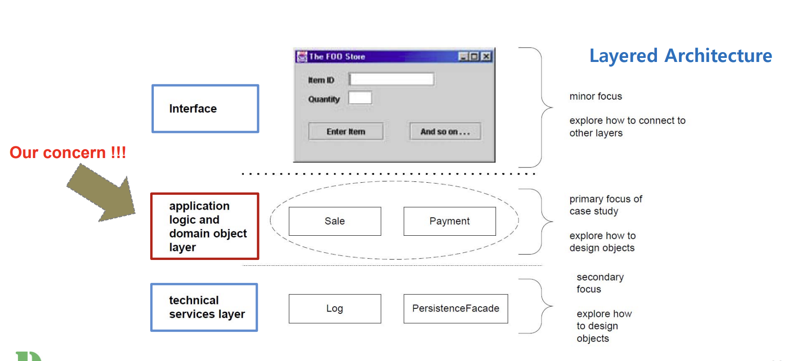

# Chapter 3.Case Studies

## What is Covered in the Case Studies?

- 일반적인 application의 주요 구성 요소
  - 사용자 인터페이스 (UI)
  - `Core(핵심) application Logic`
  - 운영 체제, DB 접근 및 외부 소프트웨어/하드웨어 컴포넌트와의 협업

- 여기에서는 핵심 애플리케이션 로직에 대하여 초점을 맞춰야 함을 강조하며 일반적인 3-tier 아키텍처를 설명한다.

  - Presentation Layer : 사용자 인터페이스와 관련된 부분으로, 사용자의 입력을 받아 처리하고, 결과를 사용자에게 보여주는 역할을 한다. 여기서 'Interface'가 그 역할을 한다.

  - Business Logic Layer : 여기서 언급된 '핵심 애플리케이션 로직'이 해당되며, 이 계층은 사용자의 요청에 따른 처리를 담당하며 시스템의 데이터를 관리하고 비즈니스 규칙에 따라 데이터를 처리한다. 많은 아키텍처에서는 이를 Controller Layer 혹은 Service Layer라고 한다.

  - Data Access Layer : 이 계층은 데이터베이스나 파일 시스템과 같은 데이터 저장소에 직접적으로 접근하며, 데이터의 영구적 저장 및 검색을 담당한다. 