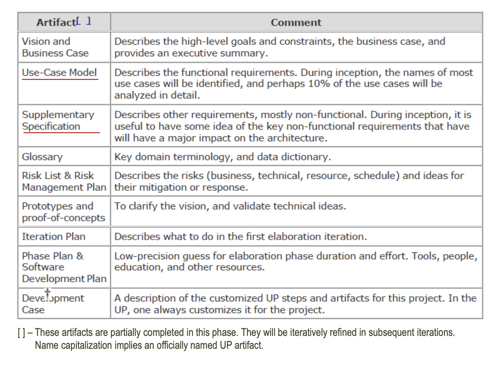

# Chapter 4.Inception is Not the RequirementsPhase

## What is Inception?

- 대부분 프로젝트들은 초기 단계에서 다음과 같은 질문을 던진다.
  1. 이 프로젝트의 비전과 비즈니스 사례는 무엇인가 ?
  2. 실행 가능한가?
  3. 구매해야 하나, 아니면 직접 제작해야 하나 ?
  4. 대략적인 비용 범위는 어느 정도인가? 예를 들자면 , 1만 달러 ~ 10만 달러 사인가 ? 아니면 수백만 달러인가?
  5. 프로젝트를 진행해야 하나, 중단해야 하나 ?

- 인셉션 단계는 짧게 진행되어야 한다.
  - 대부분 프로젝트에서는 1주일이면 충분하다.
  - 대부분 요구사항 분석은 Inception단계가 아닌 Elaboration 단계에서 진행된다.

## Artifacts Start in Inception

- 이 표는 UP의 인셉션 단계에서 시작하는 다양한 아티팩트를 설명하고 있다.
- 여기에 나열된 각 아티팩트의 목적과 역할은 다음과 같다.

  1. Vision and Business Case: 프로젝트의 high-level 목표와 제약사항(Constraints), business case를 설명하며 executive summary를 제공한다.
    - Business Case : 프로젝트 또는 작업의 정당성을 입증하는 문서로, 투자의 이유와 함께 프로젝트의 경제적 타당성, 예상되는 비용과 이익, 리스크 평가 등을 포함하여, 프로젝트를 진행해야 하는 사업적 이유를 종합적으로 분석하고 제시한다.
    - 실행 요약(Executive Summary) :  보고서나 제안서, 비즈니스 계획서 등의 주요 내용을 간략하게 요약한 섹션으로, 가장 중요한 포인트를 명확하고 간결하게 전달하기 위한 것이다.

  2. Use-Case Model : 기능적 요구사항을 기술한다. Inception에서 대부분의 use-case 이름이 식별되며, 약 10%의 use-case가 자세히 분석된다.
    - 기능적 요구사항(functional requirements) :  `시스템이 수행해야 하는 기능에 관한 요구사항`. 즉, 사용자의 요구를 직접적으로 충족시키는 시스템의 행동이나 작동을 설명한다.
    예를 들어, 웹사이트에서 사용자가 상품을 장바구니에 추가하는 기능, 사용자가 로그인할 수 있는 기능, 사용자가 결제를 진행할 수 있는 기능 등이 기능적 요구사항에 속한다.

  3. Supplementary Specification : 주로 비기능적 요구사항을 기술한다. 인셉션 단계에서 아키텍처에 주요한 영향을 미칠 수 있는 비기능적 요구사항에 대한 이해를 도와준다.
    - 비기능적 요구사항 (other requirements) : `시스템이 어떻게 동작해야 하는지에 대한 요구사항`으로 성능, 보안, 신뢰성, 재사용 가능성, 호환성 등과 같은 `품질 관련 속성`을 나타낸다. 예를 들어, 웹사이트가 1초 이내에 페이지를 로드해야 한다는 성능 요구사항, 사용자 데이터를 암호화하여 저장해야 한다는 보안 요구사항, 시스템이 매일 밤 자동으로 백업을 수행해야 한다는 신뢰성 요구사항 등이 비기능적 요구사항에 해당한다.

  4. Glossary : 주요 도메인 용어와 데이터 사전을 정의한다.

  5. Risk List & Risk Management Plan : 비즈니스, 기술적, 자원, 일정에 대한 리스크를 기술하고 이에 대한 대처방안이나 반응을 설명한다.

  6. Prototypes and proof-of-concepts : 비전을 명확히 하고 기술적 아이디어를 검증한다.

  7. Iteration Plan : 첫 Elaboration 단계에서 무엇을 할지를 기술한다.

  8. Phase Plan & Software Development Plan : Elaboration 단계의 기간과 노력에 대한 정밀도 추측을 제공한다. 도구, 인력, 교육, 기타 자원에 관한 계획이다.

  9. Deployment Case : 이 프로젝트에 맞게 조정된 UP 단계와 아티팩트에 대한 설명이다. UP는 항상 프로젝트에 맞게 맞춤화 된다.

## How Much UML During Inception ?

- inception 단계의 목표는 다음과 같은 충분한 정보를 모으는 것이다.
  1. 공통된(common) vision을 설정. (common vision이란 프로젝트 팀, 이해관계자들, 프로젝트에 영향을 받는 모든 사람들이 공유하는 프로젝트의 기본 목표나 방향성을 말한다.)
  2. 프로젝트를 진행하는 것이 실현 가능한지에 대한 정보
  3. 프로젝트가 elaboration 단계에서 심도있는 조사를 진행할만큼 가치가 있는지 결정하기위한 정보

- Inception 단계에서는 UML 다이어 그램 작성에 너무 많은 시간을 할애하지 않고, 필요한 정보를 수집하는 데 집중해야 한다.
  - Inception 단계에서는 기본 범위와 요구사항의 대략 10%정도만 이해하는 데 집중하며, 대부분의 요구사항은 텍스트 형식으로 표현한다.
  - 실제 UML 다이어그램 작성은 다음 단계인 Elaboration에서 대부분 이루어진다.