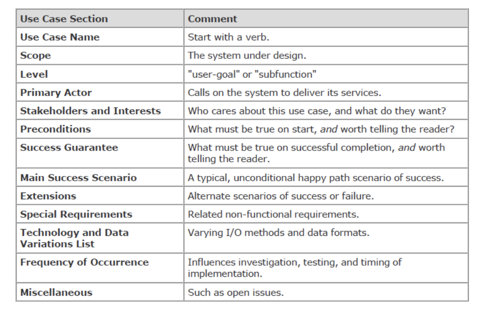
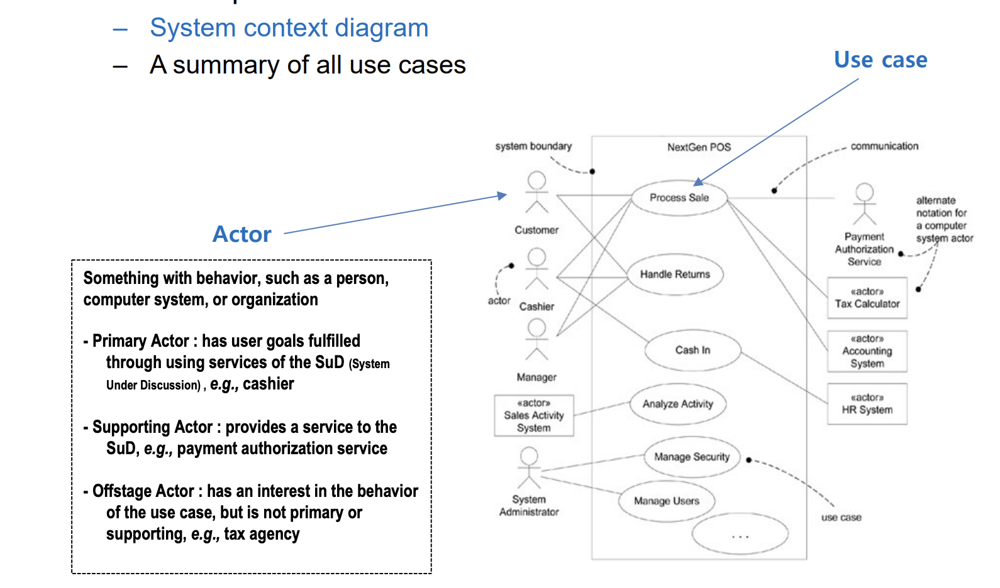
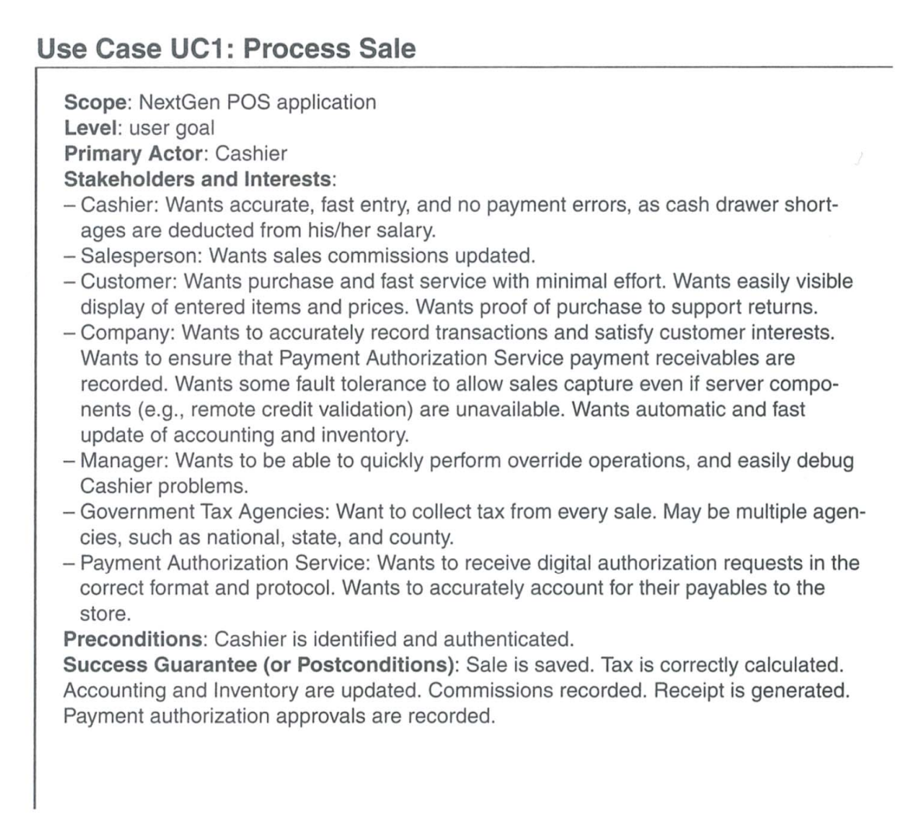
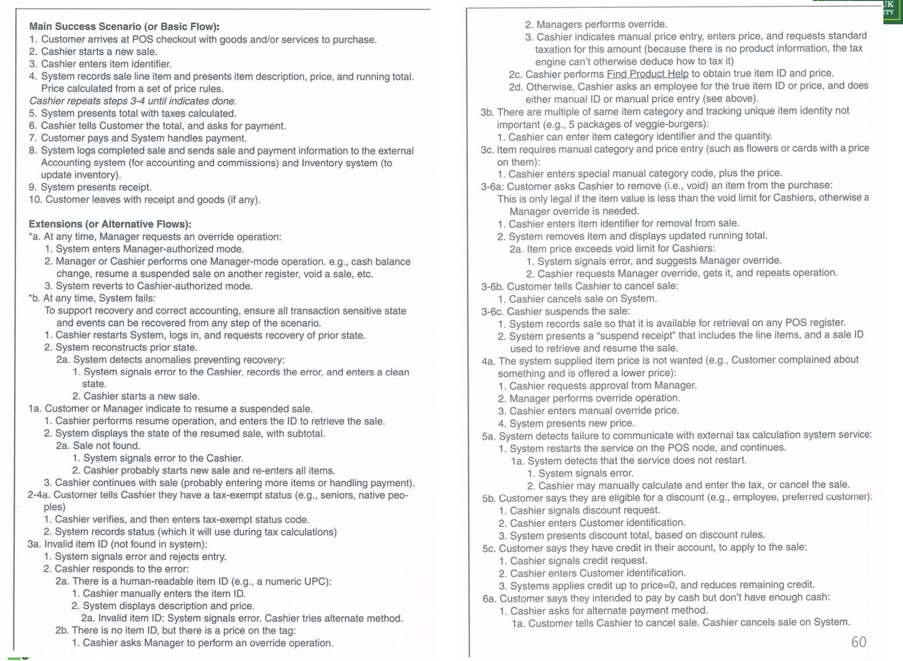
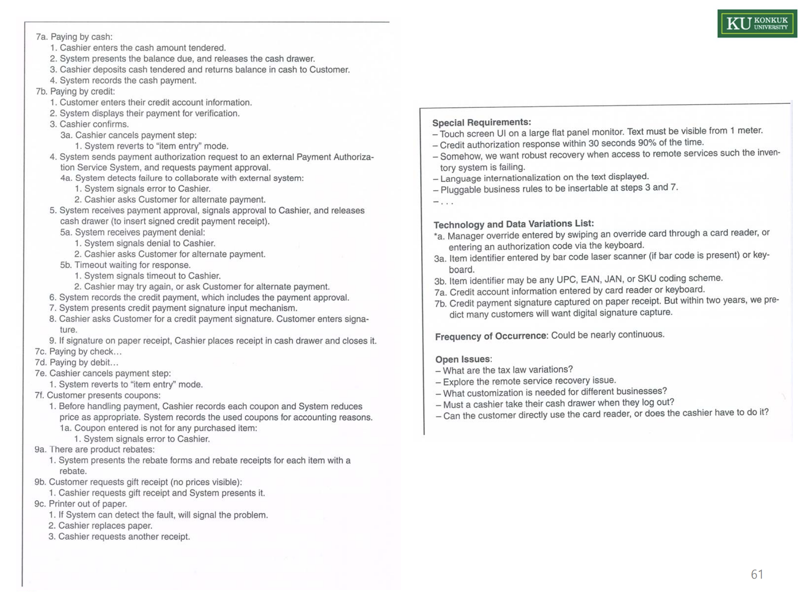
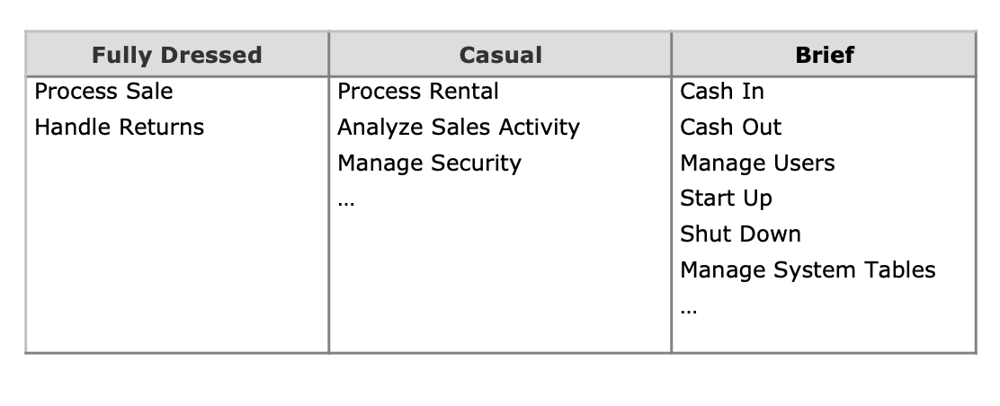

# Chapter 6.Use Cases

## Use Cases 란
- Use Cases란 시스템을 사용하는 actors이 목표를 달성하기 위한 텍스트 스토리
- 시스템 요구 사항을 분석하기 위한 매커니즘
> 사용 사례(Use Case)는 주로 소프트웨어 개발의 초기 단계, 즉 요구 사항 수집 및 분석 단계에서 작성된다.
- 예시 - 'Process Sale'
  - 고객이 상품 구매를 위해 계산대로 간다.
  - 캐셔가 POS를 사용해 상품 기록
  - 시스템이 구매 총액과 상품 세부사항 제시
  - 고객 결제 정보 입력, 시스템 검증 및 기록.
  - 재고 업데이트, 고객에게 영수증 제공 후 상품과 함께 출발.
- Use Case는 다이어그램이 아닌 그냥 text이다.
- 다음은 Use Case 문서 구성 요소이다.




- Use Case Name : 동사로 시작해야한다.
- Scope (범위): 설계 중인 시스템의 범위
- Level (수준): 사용자의 목표 또는 하위기능
- Primary Actor (주요 행위자): 시스템이 서비스를 제공해야 하는 대상
- Stakeholders and Interests (이해 관계자와 이해관계): 이 use case에 대해 관심을 가지고 있는 사람은 누구이며, 그들이 무엇을 원하는지
- Preconditions (전제 조건): 시작 전 필수 조건
- Success Guarantee (성공 보장): 성공 후 반드시 충족되어야 할 조건
- Main Success Scenario (주요 성공 시나리오): 성공의 기본적인 경로
- Extensions (확장): 성공 또는 실패의 대체 경로
- Special Requirements (특별 요구 사항): 비기능적 요구 사항
- Technology and Data Variations List (기술 및 데이터 변형 목록): 다양한 입력/출력 방법과 데이터 형식
- Frequency of Occurrence (발생 빈도): 구현에 영향을 미치는 조사, 테스트, 타이밍
- Miscellaneous (기타): 고려해야 할 추가 사항.


## Use Case Diagram
- Use Case Diagram은 Actors와 Use Cases의 이름, 그리고 그들 사이의 관계를 시각적으로 표현한 것이다.
- 이 다이어그램은 시스템의 맥락 다이어그램(System Context Diagram)이며, 모든 Use Case의 요약을 제공한다.
> System Context Diagram이란 시스템이나 소프트웨어의 경계를 정의하고, 시스템 외부의 요소들 (예: 사람, 외부 서비스)과 시스템 간의 상호 작용이나 데이터 흐름을 표현하는 다이어그램이다.
- Actor(행위자)는 행동을 나타내는 대상으로, 사람, 컴퓨터 시스템, 또는 조직일 수 있다. 그리고 다음과 같은 유형의 행위자가 있다.
  - Primary Actor : 시스템을 사용함으로써 자신의 목표를 달성하는 주체 (예 : 캐셔, User)
  - Supporting Actor : 시스템에 서비스를 제공하는 행위자 (예 : 결제 인증 서비스, Other DVM)
  - Offstage Actor : Use Case의 행위에 대한 interest는 있지만 Primary or Supporting는 아닌 행위자 (예 : 세무 기관, Bank System)



- Actor는 스틱맨 아이콘
- Use Case는 타원으로 표시
- Actor와 Use Case는 선으로 연결되어 있으며, 이는 둘 사이의 상호작용을 나타낸다.
- 또한 시스템의 경계를 나타내는 직사각형이 있어, 어떤 Use Case가 시스템 내부에 속하는지, 어떤 Actor가 시스템과 상호작용하는지를 명확히 보여준다.


## Are Use Cases Functional Requirements?
- Yes, Use Case는 요구사항이며 주로 기능적(행위적) 요구사항이다.
- FURPS+ 요구사항 유형에서 "F"에 해당한다.

> 요약하자면 Use Case는 시스템이 수행해야 하는 특정 기능이나 행동을 설명하는데 사용된다.
> 이는 시스템이 사용자에게 제공해야 하는 서비스나 작업을 정의하는 데 중요한 역할을 한다.
> Use Case는 단순히 시스템의 기능을 넘어 사용자와 시스템 간의 상호작용을 포함하는 포괄적인 접근 방식을 취한다.


## Three Common Use Case Formats

1. Brief
  - 한 문단으로 요약된 짧고 간결한 설명
  - 주로 주요 성공 시나리오 또는 성공적인 경로를 간단히 서술한다.

2. Casual(비공식적 형식)
  - 비공식적인 문단 형식을 사용한다.
  - 다양한 시나리오를 다루는 여러 문단으로 구성된다
  - 예시 - Handle Returns
  ```
  주요 성공 시나리오 : 
  고객이 반품할 상품을 들고 계산대에 나온다. 캐셔는 POS 시스템을 사용하여 각 반환된 상품을 기록한다...

  대체 시나리오들 : 
  고객이 신용카드로 결제했고, 환급 거래가 신용 계좌로 거부된 경우, 고객에게 알리고 현금으로 지급합니다.

  상품 식별자가 시스템에서 발견되지 않는 경우, 캐셔에게 알리고 식별자 코드의 수동 입력을 제안합니다(아마도 코드가 손상되었을 수 있습니다).

  시스템이 외부 회계 시스템과의 통신 실패를 감지하는 경우, ...
  ```

3. Fully Dressed


- 예시 : Process Sale, Fully Dressed Style

  
  
  

  - 그냥 엄청 복잡하다.. 정도 ..?

> 이러한 Use Case 는 iteration이 돌면 계속 구체화된다.


## Guideline : Write in an Essential UI-Free Style

- Use Case를 작성할 떄 Essential한 UI-Free 스타일로 쓰는 것이 좋다.
- 이 스타일은 사용자의 의도와 시스템의 책임을 표현하는 것에 중점을 두는 것다. 
- `구체적인 동작보다는 사용자가 시스템을 사용해 달성하고자 하는 목표를 강조한다.`
- 초기 요구 사항 분석 단계에서는 구체적인 사용 사례를 피하는 것이 좋다.
- 예시로 Manage Users의 Use Case의 두 가지 스타일을 비교하고 있다.

  - Essential Style
  ```
  1. 관리자가 자신을 식별한다.
  2. 시스템이 신원을 인증한다.
  3. ...
  ```

  - Concrete Style
  ```
  1. 관리자가 다이얼로그 박스에 ID와 비밀번호를 입력한다.
  2. 시스템이 관리자를 인증한다.
  3. 시스템이 “사용자 편집” 창을 보여준다.
  4. ...
  ```

> 초기 요구 사항 분석에서는 구체적인 UI 설계보다는 사용자의 의도와 필수 기능에 집중하는 것이 중요하기 때문에 Essential Style이 권장된다.

## Guideline : Write Black-Box Use Cases

- 시스템의 내부 작동이나 그 구성요소와 설계를 설명하는 것 대신에, 시스템이 무엇을 하는지 (시스템의 기능)을 정의하는 데 초점을 맞춰야 한다.
- 블랙박스 Use Case를 작성할 때는 다음 지침을 따르는 것이 좋다.
  1. 시스템이 내부적으로 어떻게 작동하는지를 쓰면 안된다.
  2. 대신, 시스템이 수행하는 기능이 무엇인지를 정의해야 한다.
- 다음은 '판매 기록'에 관한 Use Case에 대한 올바른 접근과 그렇지 않은 접근의 예시이다.

  - Black-box Style (올바른 방식)
    - 시스템은 판매를 기록한다.
  
  - Not (잘못된 방식)
    - 시스템은 DB에 판매를 기록한다.
    - 더 나쁜 경우 : 시스템은 판매에 대한 SQL INSERT 명령문을 생성한다.

> 블랙박스 스타일의 작성 방식에서는 '시스템이 판매를 기록한다'정도로 말함으로써 사용자가 이해할 수 있는 수준에서 시스템의 기능을
> 서술한다. 반면, 구체적인 기술적 세부사항은 사용자가 알 필요가 없는 내부 매커니즘이므로 초기 분석 단계에서는 피해야 할 내용이다.
> Use Case는 사용자와 이해관계자가 시스템의 기능을 명확히 이해할 수 있도록 작성되어야 한다.


## Process : Evolutionary Requirements in Iterative Methods


- 이 그림은 UP에서 반복적이고 점진적인 개발 프로세스의 컨텍스트에서 요구사항이 어떻게 발전하는지를 보여준다.
- UP에서는 프로젝트가 여러 단계를 거치면서 요구사항이 점진적으로 확립되고 발전된다.
- 초기 단계인 Inception에서 요구사항에 대하여 정의하기 시작하고, Elaboration단계에서 이러한 요구사항에 대하여 더 깊이 있게 분석하고 정제해야 함을 나타낸다.

## Case Study : Use Cases in the NextGen POS

- 다음은 NextGen POS 시스템의 Use Case가 어떻게 초기 단계인 Inception 단계에서 개발되고 점진적으로 정제되는지를 보여준다.
- 아래 그림은 NextGen POS의 Inception단계의 Use Case이다.

