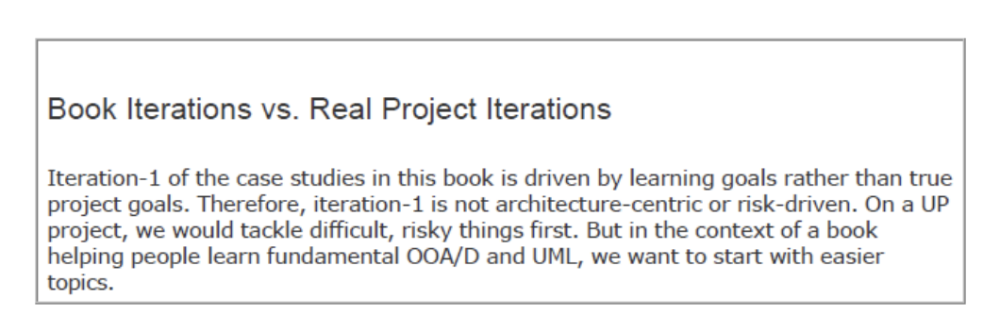
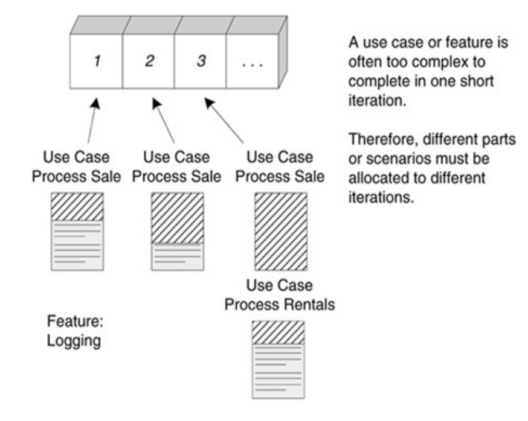
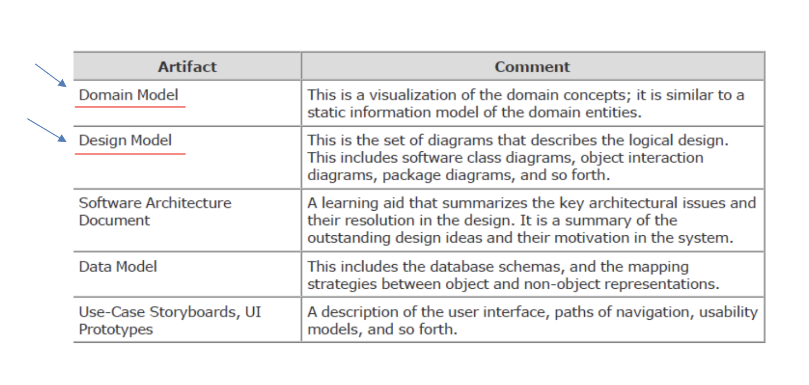

# Chapter 8. Iteration 1 Basics

## What Happened in Inception ? 

- Inception단계는 일반적으로 1주일 정도, 짧은 기간동안 진행되며 프로젝트의 기초를 다지는 중요한단계이다.
- Inception에서 진행하는 활동은 다음과 같다.
  - A short requirements workshop
  - 주요 Actors, 목표, Use Cases 네이밍
  - 대부분 Use Cases는 brief 형식으로 작성된다. (약 10 ~ 20%만 full dressed하게 작성됨)
  - 가장 영향력 있고 리스크가 높은 요구사항을 식별
  - Vision 과 Supplementary Specification의 첫 번째 버전을 작성
  - Risk List 작성
  - special requirements 의 기술적인 실현 가능성을 탐구하기 위한 proof-of-concpet(개념 증명) 프로토타입과 그 외의 조사들을 수행한다.
  - 기능적 요구사항의 비전을 명확히 하기 위해 UI 중심의 프로토타입을 만든다.
  - Elaboration 단계에서 세부화할 구성요소들을 buy/build/reuse에 관한 권장사항을 제시한다.
  - High-level candidate 아키텍처와 컴포넌트를 제안한다.
  - 첫 번째 iteration에 대한 plan을 세운다.
  - Candidate(후보) Tools list를 작성한다.

> 이처럼 Inception 단계에서는 보다 상세한 계획과 개발로 나아가기 전에 프로젝트의 기본적인 구조와 범위를 설정하고, 중요한 요구사항과 위험 요소들을 파악하는 데 중점을 둔다. Inception 단계는 프로젝트 팀이 프로젝트에 대한 전반적인 이해를 갖고, Elaboration 단계에서 수행될 더 깊은 분석과 계획에 대비하게 만든다.

## On to Elaboration (Elaboration을 향해서)

- Elaboration단계에서는 다음과 같은 작업들이 주로 이루어진다.

  ### 핵심적이고 위험한 소프트웨어 아키텍처 개발 및 테스트 
    - Elaboration단계에서는 시스템의 기본적인 구조를 설계하고, 프로젝트에 가장 큰 영향을 미칠 수 있는 위험한 부분에 대해 프로그래밍과 테스트를 진행하여 이를 검증한다.

  ### 요구사항 발견 및 안정화 
    - 대다수의 요구사항이 이 단계에서 식별된다.
    - 이해 관계자들의 피드백과 분석을 통해 이 요구사항들이 명확해지고 안정적인 형태로 정립된다.
    - 여기서 이해 관계자들이란 프로젝트에 영향을 미칠 수 있는 모든 사람들 (Client, User, 프로젝트 팀 멤버, 경영진 등)
  
  ### 주요 위험 요소들의 완화 또는 해소
    - 프로젝트에서 식별된 위험 요소들에 대한 대응책을 수립하고, 가능한 한 많은 위험을 줄이거나 제거하여 프로젝트의 성공 가능성을 높인다.

> 여기에서는 Inception단계가 끝나고 프로젝트가 더 세부적인 계획과 구체적인 개발 작업으로 넘어가는 전환점을 나타내고 있으며 Elaboration 단계에서 수행되어야 할 핵심 활동들에 대한 개요를 제공한다.

## 1 Requirements and Emphasis

- 소프트웨어 개발 프로세스에서 첫 번째 iteration 단계에 대한 요구사항과 중점 사항을 설명할 것이다.
- Iterative한 개발 방식에서는 프로젝트가 여러차례의 반복을 거치며 점진적으로 발전하게 되기 때문에 첫 번째 iteration에서는 프로젝트의 기본을 설정하고 프로세스를 시작하기 위한 아주 중요한 단계이다.

- 그에 대한 예로 NextGen POS 시스템의 첫 번째 iteration을 나타내고있다.
  - NextGen POS 시스템의 예시에서 첫 번째 반복의 요구사항은 다음과 같다.
    - 'Process Sale' 사용 사례의 기본적이고 핵심적인 시나리오를 구현한다. 여기에는 항목 입력과 현금 결제 수신이 포함됩니다.
    - iteration를 지원하기 위해 필요한 경우 'Start Up' Use Case를 구현한다. (Start up use case란 소프트웨어가 시작될 때 초기 설정을 로드하거나 필요한 서비스를 활성화하는 등의 과정을 포함하는 use case)
    - 예외 상황이나 복잡한 로직을 생각하지 않고, 단순한 '행복 경로(happy path)' 시나리오와 이를 지원하는 디자인 및 구현에 집중한다. (행복 경로란 사용자가 시스템을 사용할 때 겪을 수 있는 가장 기본적이고 문제가 없는 시나리오를 의미)
    - 세금 계산기나 데이터베이스와 같은 외부 서비스와의 상호작용은 포함하지 않는다.
    - 상품이나 서비스의 가격을 결정하는 복잡한 로직이나 조건들을 구현하지 않겠다.
  

## Implement Requirements Incrementally

- 점증적 개발이란, 한 Use Case에 대하여 여러 단계에 걸쳐 조금씩 개발해 나가는 방식이다.
- 이 방법은 특히 한 단계에서 모든 것을 완성하기에는 너무 복잡한 Use Case나 기능을 다룰 때 유용하다.

- 첫 번째 반복(Iteration 1)에서의 요구사항은 전체 요구사항이나 사용 사례의 일부분만 포함된다. 즉, 전체 기능의 일부분만을 먼저 구현한다.
- 하나의 Use Case나 기능이 한 번의 short iteration동안 완료하기에는 복잡할 수 있기 때문에, 다른 부분이나 시나리오들은 다른 iteration 단계로 배분된다.

## UP Artifacts Start in Elaboration

- Elaboration에서 시작되는 UP Artifacts들은 한 번의 iteration으로 완성될 필요가 없다. 
- 즉, 여러 반복에 걸쳐 점진적으로 refine 되어야 한다.
- 각 아티팩트에 대한 설명은 다음과 같다.

- 도메인 모델(Domain Model): 도메인 개념들의 시각화이며, 도메인 엔티티들의 static한 information 모델과 유사하다. 즉, 시스템이 동작하는 비즈니스 영역의 주요 개념과 관계를 나타내는 다이어그램이다.

- 설계 모델(Design Model): 소프트웨어나 시스템의 설계를 시각적으로 나타내는 다이어그램의 집합이다. 여기에는 클래스 다이어그램, 객체 상호작용 다이어그램, 패키지 다이어그램 등이 포함될 수 있다.
  - 클래스 다이어그램(Class Diagram): 객체 지향 소프트웨어의 클래스들과 그 클래스들 간의 관계를 표현하는 다이어그램
  - 객체 상호작용 다이어그램(Interaction Diagram): 시스템 내의 객체들 간의 상호작용, 즉 메시지 전달과 흐름을 나타내는 다이어그램. 시퀀스 다이어그램이나 커뮤니케이션 다이어그램이 이에 해당한다.
  - 패키지 다이어그램(Package Diagram): 소프트웨어의 더 큰 구조를 보여주기 위해 시스템을 논리적 단위인 패키지로 분류한다. 각 패키지는 일련의 클래스, 인터페이스, 혹은 다른 패키지를 포함할 수 있으며, 패키지 다이어그램은 이러한 패키지들 간의 의존성과 조직을 보여준다.

- 소프트웨어 아키텍처 문서(Software Architecture Document): 시스템의 주요 아키텍처 이슈와 설계상의 결정을 요약해 설명하는 도구이다. 이 문서는 뛰어난 설계 아이디어와 시스템에서 그들의 motivation을 제공한다.

- 데이터 모델(Data Model): 데이터베이스 스키마와 객체 및 비객체 표현 간의 매핑 관계를 나타낸다. 이는 데이터가 어떻게 조직되고 관리되어야 하는지에 대한 정보를 제공한다.

- Use case 스토리보드 및 UI 프로토타입(Use-Case Storyboards, UI Prototypes): 사용자 인터페이스, 탐색 경로, 사용성 모델 등을 나타낸다. 이는 사용자 경험과 상호작용 디자인에 중점을 둔다.

