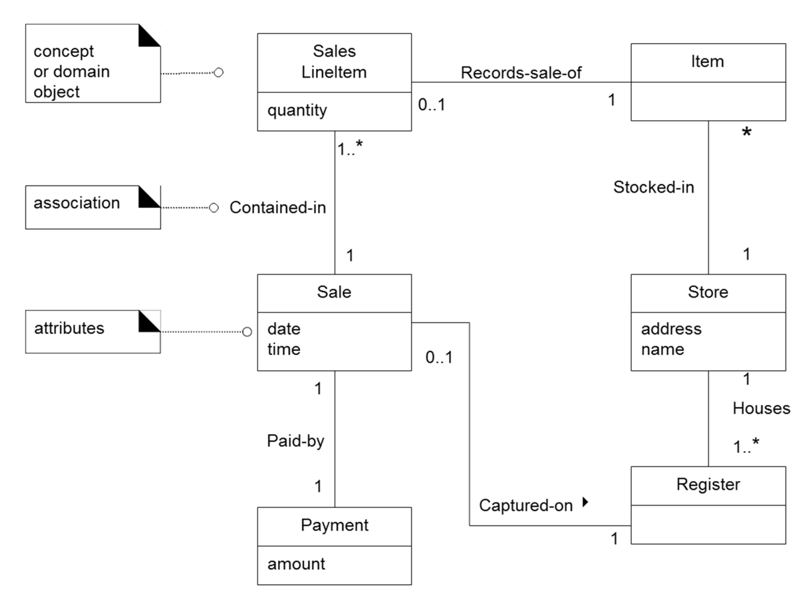
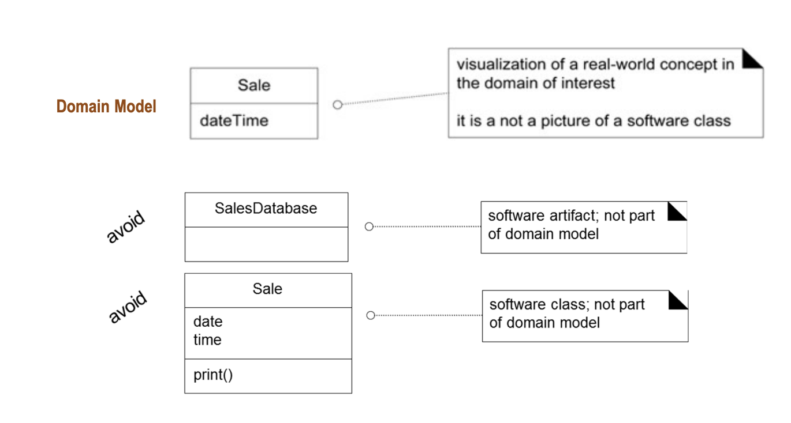
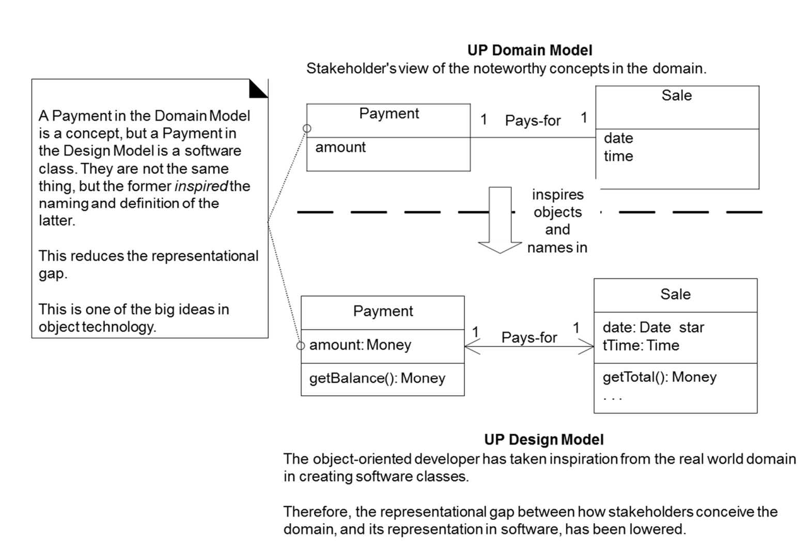
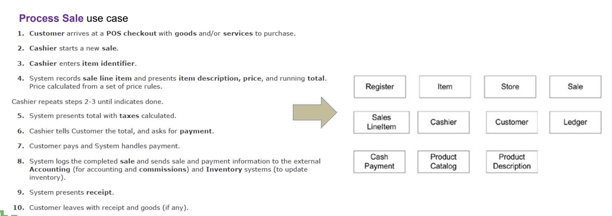
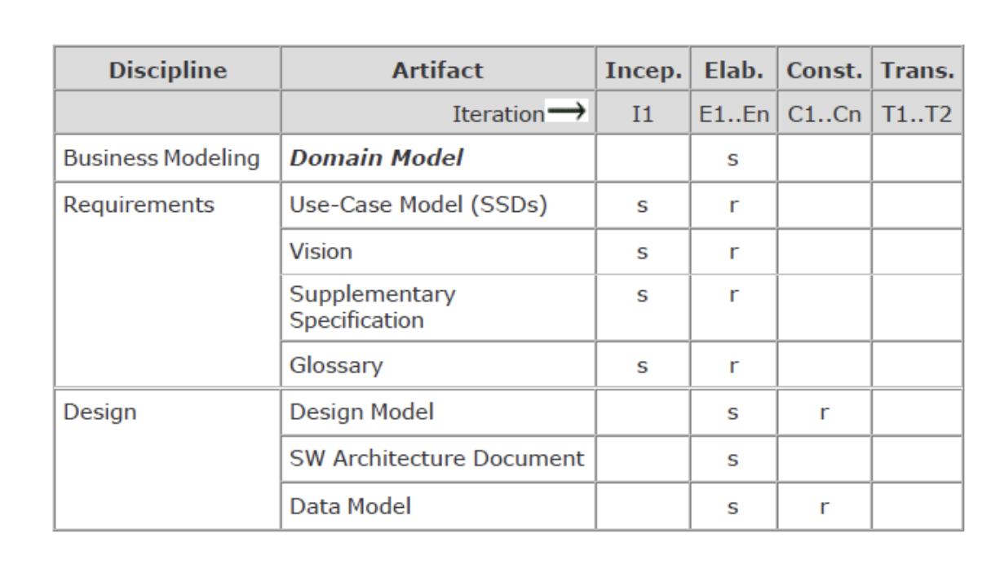
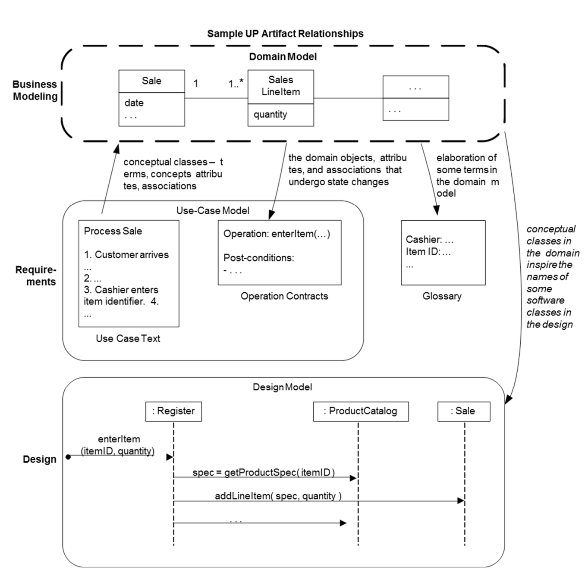

# Chapter 9.Domain Models

## Domain Model이란

- 도메인 모델은 객체 지향 분석(OOA)에서 매우 중요한 부분으로, 특정 영역(도메인)에서의 개념적인 클래스나 real-situation 객체들의 시각적 표현이다.
> 무슨 이야기냐면 도메인 모델은 우리가 만들고 싶은 앱이나 프로그램이 어떤 주제나 분야에 관한 것인지를 그림으로 보여주는 것이다.
> 예를 들어 학교 시스템을 만든다고 하면 선생님, 학생, 수업 같은 것들이 각각 어떤 정보를 가지고 있는지, 이런 것들이 서로
> 어떻게 연결되어 있는지를 나타내는 그림이다.  
> 여기서 Conceptual class(개념적 클래스)란, 그 주제나 분야에 속한 중요한
> 아이디어나 '개념'들을 말한다. 예를 들어 '학생'이라는 클래스에는 이름, 나이, 반 정보 등이 들어갈 수 있을 것이다.
> 이런 걸 그림으로 그려서 프로그램을 만드는 사람들이 전체적인 관점을 이해할 수 있도록 돕는 것이다.

- 도메인 모델의 특징은 다음과 같다.

  1. 주목할만한 abstractions, 도메인 vocabulary, 도메인의 콘텐츠 정보의 시각적인 dictionary이다.

  2. 소프트웨어 객체 와 클래스를 설계하는데 영감을 주는 source이다.

  3. No operations : 도메인 모델은 순수한 분석 모델이며 , 시스템이 '어떻게' 해야 하는지에 초점을 맞추는 것이 아닌 '무엇을' 해야하는지에 초점을 맞춘다.

  4. Domain Objects (or conceptual classes) : 도메인 모델에서의 객체들은 실제 시스템에서 사용될 데이터의 구조를 반영한다. 

  5. Association between Conceptual classes : 개념적 클래스 간의 관계는 도메인 내에서 객체들이 어떻게 서로 연결되어 있는지를 보여준다.

  6. Attributes of Conceptual classes : 개념적 클래스의 속성은 해당 도메인의 특징을 설명한다. 이 속성들은 객체가 실제 세계에서 어떻게 인식되고 구분되는지를 반영하며 데이터 모델링의 기반이 된다.

> 이처럼 도메인 모델은 OOA 단계에서 만들어지며 OOD 단계에서 구현될 클래스 다이어 그램의 기반이 된다. 여기서 중요한 것은 코딩을 하기 위해 만드는 클래스 처럼 만드는 것이 아닌 각 도메인이 실제 세계에서 무엇을 하는 역할인지에 초점을 맞춰 작성한다는 것이다.

## Partial Domain Model for NextGen POS

## Domain Model is Not Software Objects

- UP에서 도메인 모델은 소프트웨어 내부의 Object를 직접적으로 표현하는 것이 아니다.
- 여기서 말하는 소프트웨어 객체란 다음과 같다.
  1. C++이나 자바와 같은 객체지향 언어의 Class
  2. 데이터베이스 또는 window(유저 인터페이스상의 윈도우)같은 시스템 구현을 위해 실제로 만들어진 구성 요소들
  3. 메서드 (Operations)

## Why Create a Domain Model ?

- 도메인 모델을 만드는 두 가지 이유 : 

  1. 도메인 모델은 초기 elaboration iteration 단계에서, 프로젝트 팀이 문제를 다루는 특정 분야에 대해서 핵심 개념들과 그들 사이의 관계를 이해하도록 도와주기 때문이다.

  2. 실제 세계와 소프트웨어 설계를 가능한 가깝게 유지하게 만들어, 둘 사이의 차이를 줄이고 (lower representation gap), 현실을 잘 반영하는 클래스를 만들기 위함이다. 
    - 여기서 lower representation gap이란 도메인 모델과 실제 설계 사이의 간격을 가능한 작게 만드는 것을 의미한다.
    - 이것은 도메인 모델을 기반으로 할 때, 실제 세계와 소프트웨어 설계 사이에 일관성을 유지하려는 노력을 의미한다.

> 요약하자면, 도메인 모델을 만드는 이유는 프로젝트 팀이 문제 영역을 명확하게 이해하고, 이 이해를 바탕으로 실제 프로그램을 설계할 때 현실 세계의 요구사항을 정확하게 반영하도록 도와주기 위함이다.

## Lower Representation Gap

- 위의 이미지는 Unified Process (UP)의 도메인 모델과 디자인 모델을 보여주며, 도메인 모델이 실제 소프트웨어 설계인 디자인 모델에 어떻게 영감을 제공하는지를 설명하고 있다.

- 주목할 점은 도메인 모델의 'Payment'와 디자인 모델의 'Payment'가 같은 이름을 공유하고 있으나 실제로는 서로 다른 것들이라는 점이다.

- 도메인 모델의 'Payment'는 개념적인 것이며, 디자인 모델의 'Payment'는 소프트웨어 내에서 구현될 클래스를 나타낸다.

- 객체지향 개발자들은 실제로 코드에 적용될 소프트웨어 클래스를 만들 때, 현실 세계의 도메인에서 영감을 받아 이름을 짓고, 클래스의 속성과 메서드를 정의한다. 

- 이 접근 방식은 이해관계자들이 생각하는 도메인의 개념과 소프트웨어의 실제 구현 사이의 격차, 즉 'representational gap'을 줄이는 데 기여한다.

- 이미지의 설명에서도 언급했듯이, 도메인 모델의 'Payment'와 디자인 모델의 'Payment'는 이름은 같지만, 도메인 모델에서는 개념을 나타내고, 디자인 모델에서는 실제 소프트웨어 클래스를 나타내며, 이 클래스는 도메인 모델에서 영감을 받은 속성과 연산(메서드)을 가지고 있다.

## How to Create a Domain Model 

- 클래스 다이어그램을 만드는 방식과 동일하다.
  1. 먼저 conceptual classes를 찾고 UML 클래스 다이어그램에다 그려라
  2. 그리고 그들 사이의 관계와 attributes를 추가하면 된다.

- 그럼 conceptual classes의 이름이나 attributes의 이름은 어떻게 찾는 것인가 ?
  - 위의 그림처럼 use case에서 도메인 모델일 될 만한 명사나 명사구를 식별한다.
  - 식별한 명사와 명사구들을 바탕으로 conceptual classes의 이름이나 attributes의 이름을 짓는다.

## Is the Domain Model Correct?

- 도메인 모델은 Correct한지가 중요하기보다는 usefull한지가 중요하다. 이유는 다음과 같다.

  1. a single correct(단일하고 정확한) domain model이라는 것은 존재하지 않는다.
    - 즉 도메인 모델은 현실 세계를 완벽하게 반영할 수 없고, 대신 도메인을 이해하려는 노력의 일부로서 봐야 한다.

  2. 도메인 모델은 이해와 소통의 주요 도구이다.
    - 도메인 모델의 주된 목적은 개발자, 이해관계자, 사용자 등 특정 그룹 간의 이해를 돕고 소통을 촉진하는 것이다.
    - 도메인 모델은 복잡한 현실 세계를 단순화하여 특정 문제에 대한 공통된 이해를 구축하는데 사용된다.

> 즉, 도메인 모델은 정확하게 정의되어야 한다기 보다는 관련된 사람들이 도메인을 이해하고 소통하는데 도움이 되는지가 더 중요하다.
> 다시말하자면, 도메인 모델이 실용적인 가치를 제공하는지가 핵심이다. 

## Process : Iterative and Evolutionary Domain Modeling

- UP에서 보통 도메인 모델은 elaboration 단계에서 시작되고 완성된다.
- 즉, 도메인 모델은 elaboration 단계에서 그 핵심 구조와 필수 요소들이 정의되고, 이 단계가 끝날 때까지 주요한 개발이 마무리된다는 것을 의미한다.

## 도메인 모델과 UP에서 다른 Artifacts과의 관계

- 도메인 모델 
  - 시스템이 다룰 도메인의 개념적 표현
  - 도메인의 주요 객체, 그 속성, 그리고 이 객체들 사이의 관계를 나타낸다.
  - 비즈니스 모델링 단계에서 만들어지며, 시스템의 기초가 되는 비즈니스 개념과 규칙을 정의한다.

- Use-case Model
  - Use case를 정의할 떄 사용되며, 시스템이 수행해야할 기능적 요구 사항을 설명한다.
  - 이는 도메인 모델의 개념을 활용하여 구체적인 시스템 무엇을 해야 하는지를 설명한다.

- Design Model
  - 소프트웨어 아키텍처의 구체적인 설계를 보여준다.
  - UML 시퀀스 다이어그램을 통해 구현할 클래스와 이 클래스들이 어떻게 상호작용하는지 표현된다.
  - 디자인 모델은 도메인 모델에서 얻은 정보를 바탕으로 구현을 위한 세부 사항을 추가한다.

  