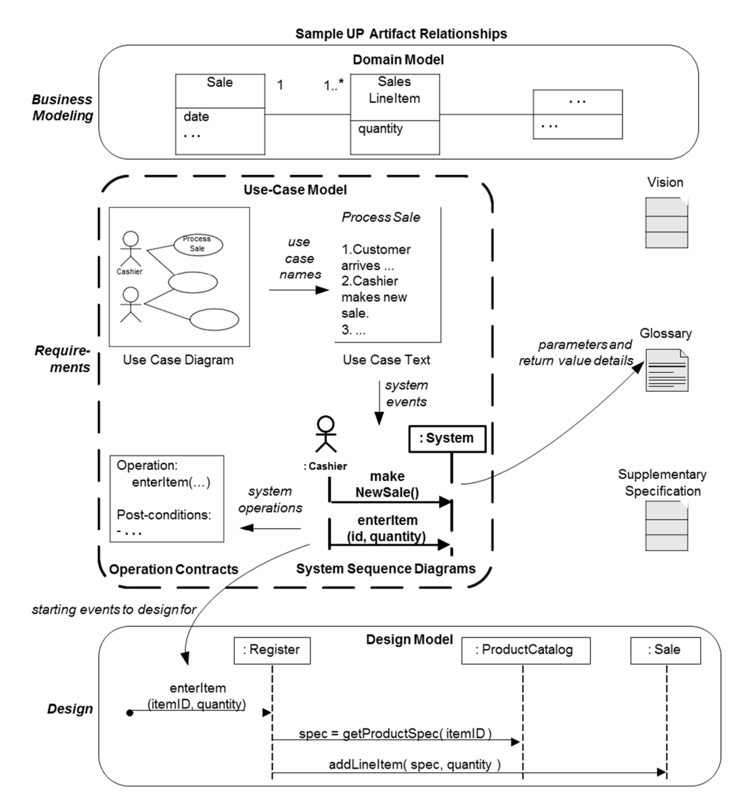
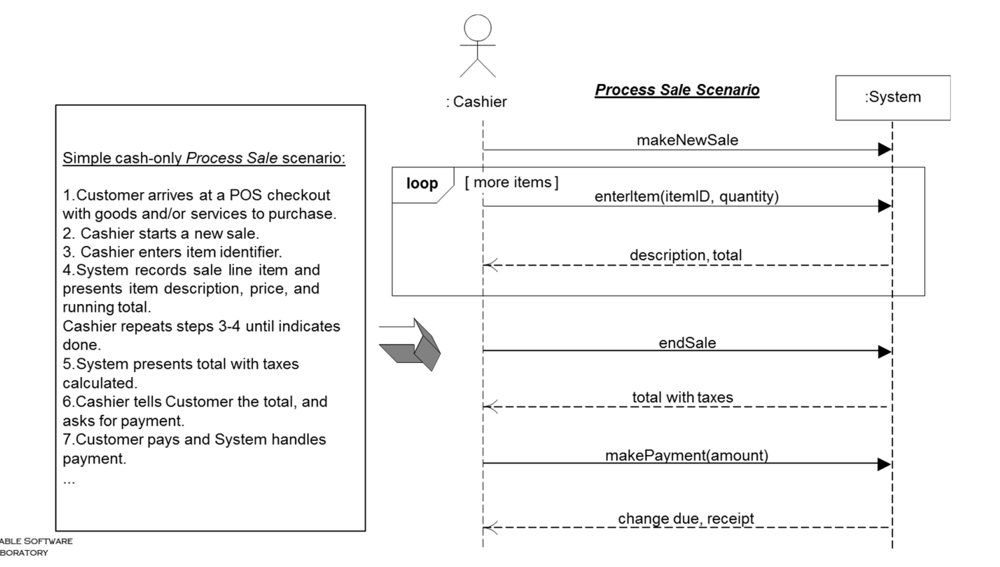
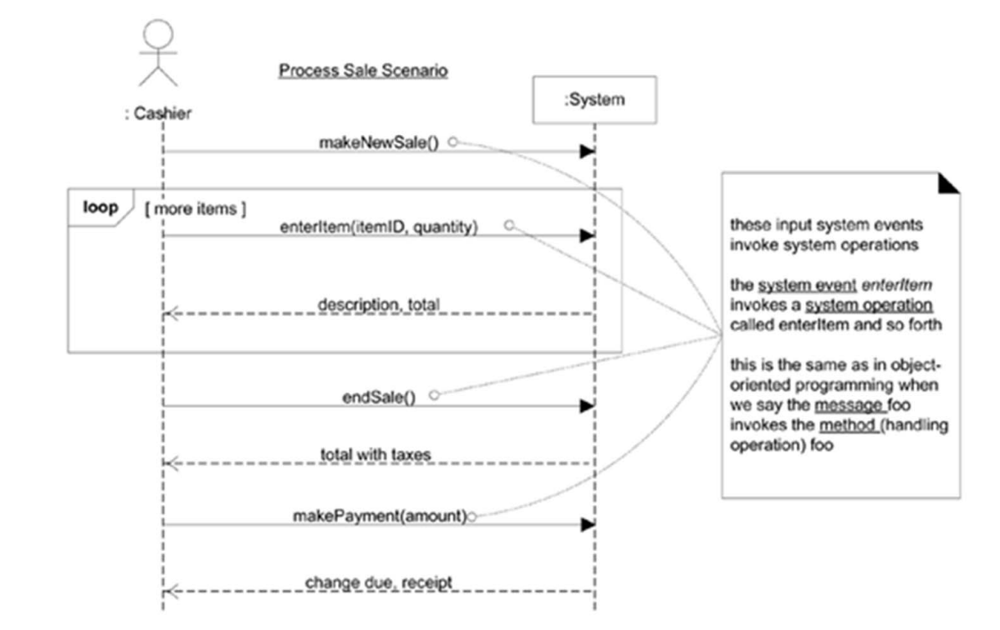
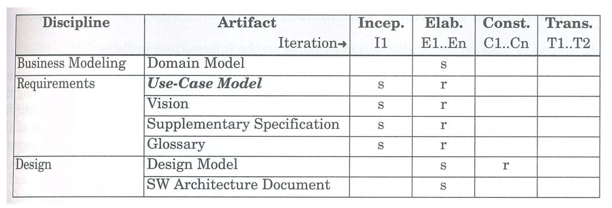

# Chapter 10.System Sequence Diagram

- 시스템 시퀀스 다이어그램(SSD)은 Use Case의 특정 시나리오에서 시스템이 수행해야 하는 특정 시퀀스(순서)의 상호 작용을 나타낸다.
- SSD의 핵심 목적은 외부 Actor(사용자나 다른 시스템)가 시스템에 보내는 요청을 중심으로 시스템의 경계 내부에서 발생하는 이벤트의 흐름을 나타낸다.
- SSD는 액터로부터 시스템으로 들어오는 요청, 즉 시스템에 대한 입력 이벤트들을 시각화하며, 이들 요청이 시스템에서 어떤 순서로 처리되어야 하는지를 보여준다.
- 그러나 SSD는 시스템이 내부적으로 어떤 처리를 수행하는지는 표현하지 않는다.
- SSD는 각 Artifacts와 다음과 같은 관계를 가진다.
  - Use Case Text : Use Case를 바탕으로 SSD가 그려진다. SSD는 각 Use Case에서 시스템과 상호작용하는 객체와의 interaction을 그리는 다이어그램이다.
  - Operation Contracts : SSD에서 나타낸 Operation이 실제 어떤 역할을 하는지 적는다.
  - Glossary : SSD에서 사용되는 용어와 개념에 대한 참조로 사용된다.
  - Design Model : SSD에서 정의한 시스템 이벤트는 디자인 모델의 구성 요소들이 어떻게 상호작용하는지를 지시한다.

## System Sequence Diagram

### SSD의 특징
  - SSD는 use case의 특정 시나리오에서 외부의 Actor가 발생시키는 이벤트, 시스템의 순서도(order) 및 내부 시스템 이벤트를 표시하는 다이어그램이며 다음과 같은 요소들을 포함한다.
    1. 시스템과 직접 상호작용하는 외부의 actors
    2. 내부 로직이 숨겨진 채로 표현되는 시스템(Black box로 표현됨)
    3. Actors에 의해 발생되는 시스템 이벤트들
  - 시퀀스 다이어그램 표기법을 사용하여 이벤트의 흐름을 시간 순서대로 나타낸다.
  - 시스템이 어떻게(how) 행동을 할지가 아닌, 무엇을(what)할지에 대하여 시스템의 행동을 모델링한다.
  - 객체 설계의 입력으로 사용되며 이를 통해 시스템 작업(operation)이 결정된다.

### Use Case와의 관계
  - Use case는 외부의 Actors가 우리가 개발하려는 소프트웨어 시스템과 어떻게 상호작용하는지를 설명한다.
  - interaction동안, actor는 시스템으로부터 system events를 생성하고 그 events를 처리하기 위해 시스템에게 system operation을 요청한다.

## Applying UML : Sequence Diagrams

- UML에 SSD라는 것은 애초에 존재하지 않는다.
- 우린 그냥 SSD를 표현하기 위해 UML의 Sequence diagram 형식을 사용할 것이다.
- UML에서 시퀀스 다이어그램은 객체 간의 상호작용을 시간 순서에 따라 나타내는 데 사용된다.
- SSD안에서 '시스템'은 어떤 요청을 받고 그에 대해 어떤 반응을 보내는지만 표현되며, 그 요청을 처리하는 데 있어 내부에 어떤 일이 발생하는지는 보여주지 않는다. 이는 시스템의 외부 사용자나 다른 시스템과 어떻게 상호작용하는지를 이해하는데 중점을 두는 것이며 복잡한 시스템의 외부 행동을 단순화하여 모델링하고, 요구 사항을 명확히 정의하는데 유용하다.
- SSD는 하나의 use case의 하나의 시나리오에 대한 system events를 보여준다.

## System Operation

- 시스템 Operation이란 '블랙 박스' 컴포넌트로서의 시스템이 Public 인터페이스를 통해 제공하는 작업이다. 즉, 시스템 외부의 액터가 시스템에 요청할 수 있는 기능적인 호출을 의미한다.
- SSD는 액터에 의해 생성되는 시스템 이벤트를 나타내고, 이러한 이벤트에 대응하는 시스템 오퍼레이션을 보여준다.
- 예를 들어 위의 그림에서 캐셔(액터)가 'enterItem'이벤트를 발생시키면, 시스템은 'enterItem' 오퍼레이션을 수행한다.
- 시스템 인터페이스란 모든 use case에 걸쳐 시스템이 제공하는 오퍼레이션의 전체 set를 의미한다.

> 즉, 화살표로 나타낸 makeNewSale 같은 것들은 시스템 이벤트이고 이러한 시스템 이벤트에 대하여 시스템이 내부적으로 수행하는 작업을 시스템 오퍼레이션이라고 한다. 이 오퍼레이션은 시스템의 public interface를 통해 접근 가능하며 SSD 내에서는 이벤트에 대응하는 시스템의 행동으로 나타난다.

## Guideline : How to Name System Events and Operations?
- 시스템 이벤트는 구체적인 물리적 동작보다는 사용자의 의도를 반영해야 하며, 그 의도를 추상적으로 표현해야 한다.
- 예를 들어 scan(itemID) 와 enterItem(itemID)를 비교해보자
- 결론부터 말하자면 enterItem이름이 더 좋다.
- 왜냐하면 scan은 물리적인 동작, 즉 바코드를 스캔하는 행위를 가리키는 반면, enterItem은 사용자가 시스템에 아이템을 입력하고자 하는 의도를 더 잘 반영하기 때문이다.

> SSD에서는 이벤트를 명명할 떄, 그 이벤트가 '어떻게' 발생하는지(스캐너를 사용하는지)보다는 `무엇을 달성하려고 하는지(아이템 등록)`에 초점을 맞춰야 한다.

## Process: Iterative and Evolutionary SSDs

- 그림에서 보다시피 UP에서 SSD를 사용해야 한다고 구체적으로 언급하고 있지는 않다.
- 하지만 UP는 유연한 개발 프로세스이며, 그 맥락 안에서 유용하다고 판단되는 기술이라면 어떤 것이든 적용할 수 있다. 즉, SSD를 사용할 수 있다.
- SSD는 주로 elabroation 단계에서 생성되며, 이 단계에서 SSD는 상당히 유용하다. 참고로 elaboration 단계는 시스템 요구사항과 아키텍처를 상세하게 정의하는 단계이다.
- SSD를 통해 시스템에 대한 요청들이 무엇인지, 즉 시스템이 처리해야 할 주요 작업이 무엇인지를 명확히 할 수 있다.
- 또한 SSD는 시스템 operation contracts를 작성하고 프로젝트 추정을 지원하는 데에도 도움을 준다.

