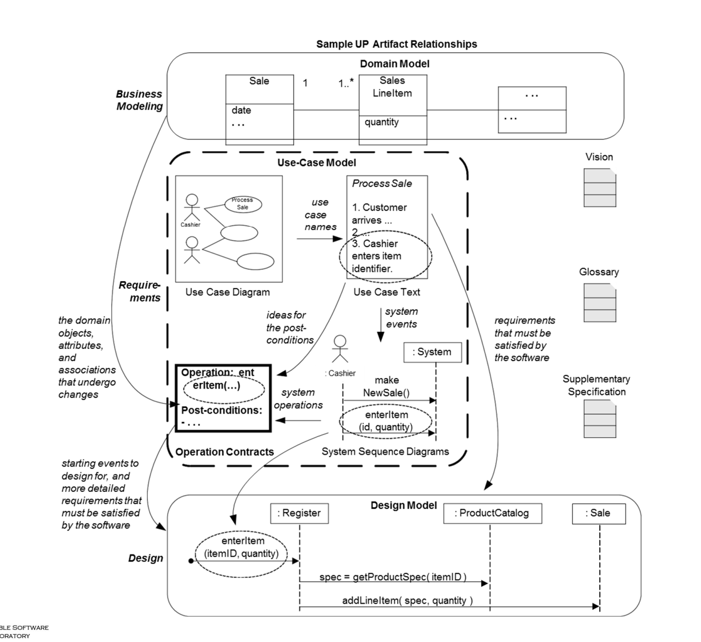
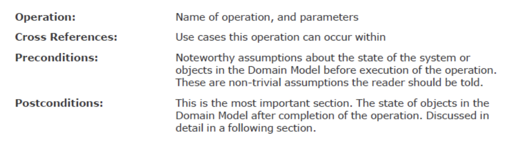
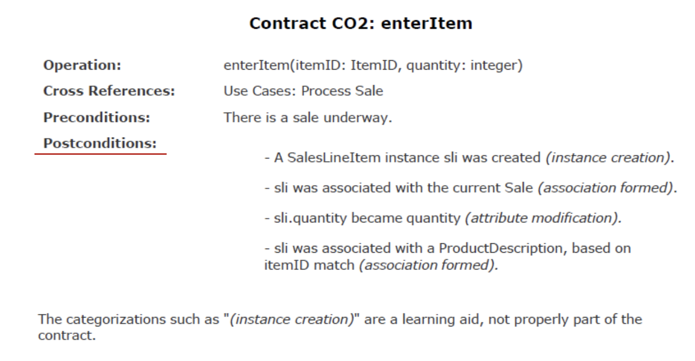
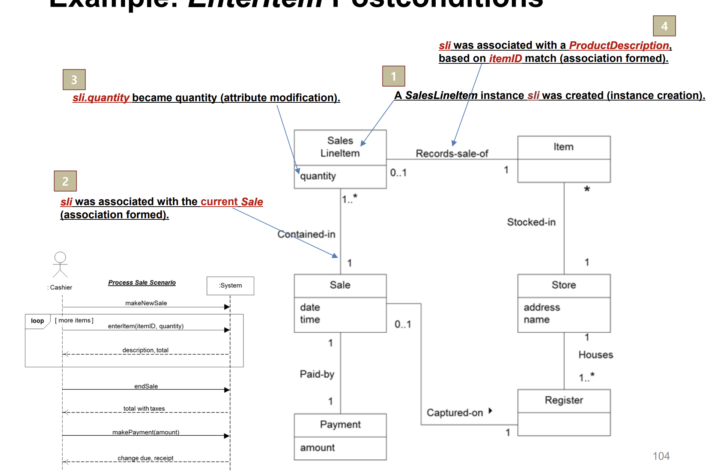

# Chapter 11.Operation Contracts




## Operation Contracts



- Operation Contracts란 특정 시스템 오퍼레이션이 호출될 때 기대되는 상태 변화를 작성한 것이며 구성요소는 다음과 같다.
  - Operation : 오퍼레이션 이름과 파라미터
  - Cross References : 해당 오퍼레이션과 관련된 use case
  - Pre-conditions : 오퍼레이션이 실행되기 전에 만족되어야 하는 조건. 예를 들어 '상품을 판매 목록에 추가하기 전에, 해당 상품이 제품 카탈로그에 존재해야한다' 와 같은 것
  - Post-conditions : 오퍼레이션이 실행된 후에 기대되는 상태 변화이다. 예를 들어 '상품이 판매 목록에 성공적으로 추가된 후, 총 판매 금액이 갱신되어야 한다'와 같은 것
- 이러한 Operation Contracts는 디자인 모델에서 메서드를 작성할 때 사용된다.
- 또한 도메인 모델에서 정의될 수 있는 high-level 시스템 오퍼레이션에 관하여 pre and post 컨디션을 나타냄으로써 복잡한 비즈니스 프로세스를 세부적으로 관리하고 검증할 수 있는 구조를 만들어낼 수 있다.

> 도메인 모델에서 정의될 수 있는 high-level 시스템 오퍼레이션이란, 굵직한 비즈니스 프로세스를 의미한다. 예를 들어 도서관 시스템에서 '도서 대여'와 같이 도메인 '도서', '고객', '대여 기록' 등이 정의될 때 정의되는 굵직한 비즈니스 프로세스이다. 이러한 고수준의 프로세스는 시스템이 사용자의 요구를 충족시키기 위해 수행해야 하는 핵심적인 작업들을 대표한다.


## Example




## Postconditions
- Postconditions은 도메인 모델 내 객채의 상태 변화를 나타낸다.
- 이는 오퍼레이션 동안 수행되어야 할 행동들을 나타내는 것이 아니라, 오퍼레이션이 끝났을 때야 말로 관찰할 수 있는 객체들의 상태를 말한다.
- 예를 들어 인스턴스의 생성 및 삭제, 관계의 형성 및 해제, 속성의 변경 등이 포함될 수 있다.
- 후속 조건은 use case 설명만으로 시스템 오퍼레이션의 결과가 명확하지 않을 떄 필요하다.
- use case가 세부적이고 복잡해서 이애하기 어려울 때 Postconditions을 기술하는 것은 매우 유용하다.


## EnterItem Postconditions



1. 인스턴스 생성: 'SalesLineItem' 인스턴스 'sli'가 생성되었다. 이것은 새로운 판매 항목이 시스템에 추가되었음을 나타낸다.
2. 관계 형성: 생성된 'sli' 인스턴스가 현재 진행 중인 'Sale'과 연결되었다. 즉, 판매 항목이 특정 판매 거래에 속함을 보여준다.
3. 속성 수정: 'sli'의 'quantity' 속성이 수정되었다. 구매된 항목의 수량이 변경되었음을 나타낸다.
4. 관계 형성: 'sli' 인스턴스가 'ProductDescription'과 연결되었다. 이것은 판매 항목이 특정 제품을 기술하는 정보와 연결되었음을 의미한다.


## Applying UML : Operations, Contracts, and OCL

- UML을 사용할 떄, 오퍼레이션, 메서드, 그리고 OCL(Object Constraint Language)에 대한 내용을 설명하려고 하며 각 용어에 대한 설명은 다음과 같다.

  1. Operation : UML에서 오퍼레이션은 객체가 호출되어 실행할 수 있는 변환(transformation)이나 조회(query)의 명세이다.

  2. Method : 메서드는 오퍼레이션의 구현이다. 즉, 오퍼레이션이 실제로 어떻게 실행될 것인지에 대한 알고리즘 또는 절차를 명시한다.

  3. UML Metamodel : UML의 구조를 정의하는 모델이다. 여기서 오퍼레이션들은 시그니처(이름과 파라미터)를 가지고 있으며, preconditions과 postconditions과 같은 제약 조건들과 연결된다. 이 제약 조건들은 오퍼레이션을 실행하기 전과 후에 만족되어야 할 조건들을 명세한다.

  4. OCL : OCL은 UML내에서 제약 조건을 표현하기 위한 공식 언어이다. 이 언어를 통해 개발자들은 오퍼레이션의 선행 조건과 후속조건, 그리고 클래스와 관계의 다른 제약 조건들을 정확하고 수학적으로 정의할 수 있다.
     - 예시 : 우리는 은행 계좌(BankAccount)의 UML 클래스 모델을 가지고 있으며, 이 클래스에는 'balance'라는 속성이 있다. 우리는 'balance'가 결코 음수가 되어서는 안 된다는 비즈니스 규칙을 가지고 있다고 하자. 이 규칙을 OCL을 사용해 다음과 같이 표현할 수 있다.

      ```ocl
      context BankAccount
      inv: self.balance >= 0
      ```