# Software Development

## Software Development

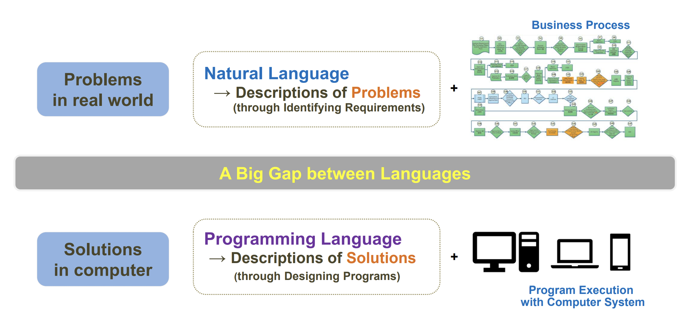

- 소프트웨어 개발은 컴퓨터에서 소프트웨어로 문제를 해결하는 것과 유사하다.
  - 현실에서의 문제 : 자연어 -> 요구사항 인식을 통한 문제의 정의 + Business Process
  - 컴퓨터에서의 해결방안 : 프로그래밍 언어 -> 프로그램 설계를 통한 문제해결 정의 + 컴퓨터 시스템으로 프로그램 실행

> 현실에서의 문제와 컴퓨터에서의 해결방안 사이에는 언어간에 큰차이가 존재한다.

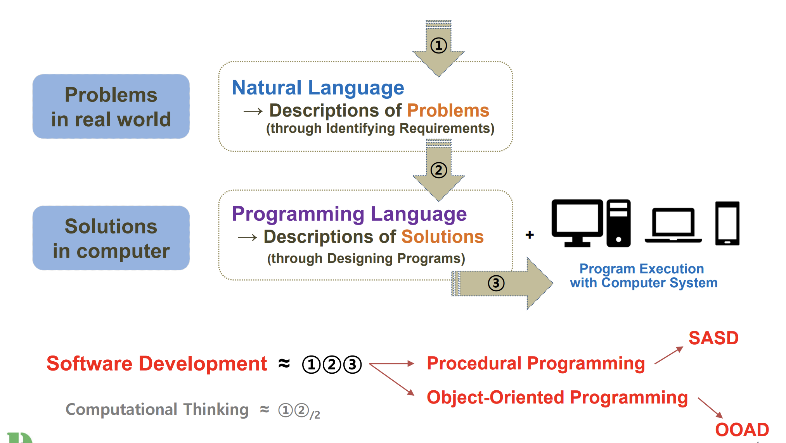

- 소프트웨어 개발은 다음 3단계로 정의할 수 있다.
  1. `자연어를 통한 현실세계의 문제 정의`: 이 단계는 문제의 이해와 분석을 포함한다. 여기서 자연어는 문제의 본질을 파악하고 요구사항을 정의하는 데 사용. 이 과정에서 비즈니스 프로세스 분석이 중요한 역할을 한다.
  2. `프로그래밍 언어를 통한 해결방안 정의`: 이 단계에서는 문제 해결을 위한 알고리즘과 데이터 구조를 설계. 이는 프로그래밍 언어를 사용하여 구체적인 해결책을 정의하는 과정을 포함.
  3. `컴퓨터 시스템에서 프로그램 실행`: 여기서는 개발된 프로그램이 실제 컴퓨터 시스템에서 실행되어 결과 생성. 이 단계는 테스트 및 유지보수도 포함할 수 있다.

- 이러한 소프트웨어 개발에 필요한 프로그래밍을 두 가지로 생각할 수 있다.
  - Procedural Programming - (SASD)
  - Object-Oriented Programming - (OOAD)

## Procedural Programming

### `Concept`

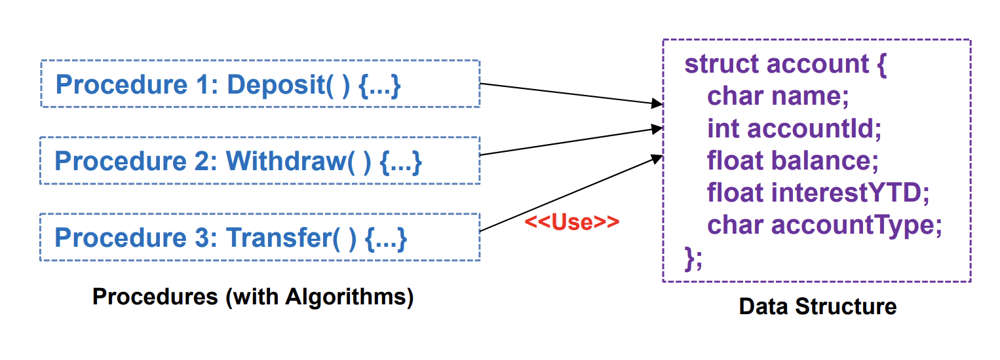

- 절차적 프로그래밍 : 이는 프로그램을 일련의 절차나 루틴(함수)으로 구성하는 방법론. 프로그램의 흐름은 순차적으로 진행되며, 데이터 처리를 위한 명령어들이 순서대로 실행.
  - Procedure / Function
    - 절차적 프로그래밍에서 함수나 절차는 프로그램의 빌딩 블록 역할
    - 이들은 특정 작업을 수행하기 위한 일련의 명령문(statement)을 포함하며, 변수의 값을 변경할 수 있다.
  - 자료구조와 알고리즘: 절차적 프로그래밍은 자료구조와 알고리즘에 큰 중점을 둔다.
    - 알고리즘(Algorithm): 문제 해결을 위한 명령어의 집합으로, 프로그램이 어떻게 동작해야 하는지를 정의 - 제어 중심(Control-Centric)
    - 자료구조(Data Structure): 데이터를 조직, 관리, 저장하기 위한 구조 - 데이터 중심(Data-Centric)
  - FORTRAN과 C는 절차 지향적 프로그래밍 언어의 대표적인 예. 이 언어들은 프로그램을 작업을 수행하는 함수의 집합으로 구성하며, 이 함수들은 데이터를 처리하고 결과를 반환

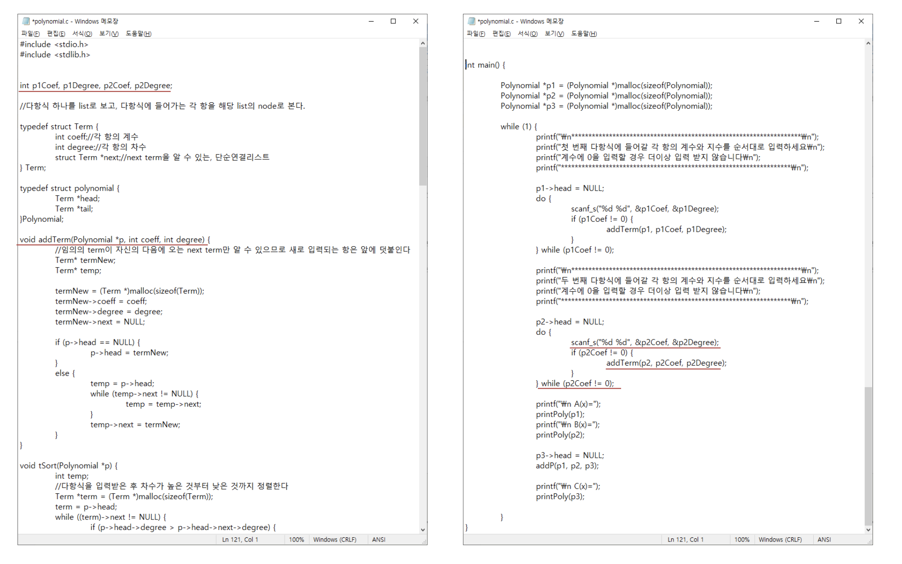

### `SASD` (Structured Analysis and Structured Design)

- 전통적인 소프트웨어 개발 방법론으로서, 절차적 프로그래밍에 적합하게 설계되었다.
- 구조적 모델링: 'Top-Down Divide & Conquer' 방식으로, `크고 복잡한 문제를 작고 쉽게 다룰 수 있는 문제로 분할`한다. 이 접근 방식은 전체 문제를 체계적으로 해결할 수 있도록 도와준다.
- 함수적 시각: `문제를 해결하기 위해 데이터 흐름 다이어그램(DFD)을 사용하여 문제의 함수적 관점을 제공`한다. DFD는 데이터가 시스템 내에서 어떻게 흐르고 처리되는지를 시각적으로 나타내어 개발자가 이해하기 쉽게 도와준다.
- 제어 기능: `유한 상태 기계(FSM)를 사용하여 시스템의 제어 기능을 관리`한다. FSM은 시스템의 각 상태를 정의하고, 상태 간의 전환을 제어하는 데 사용되어 시스템의 동작을 명확하게 표현한다.

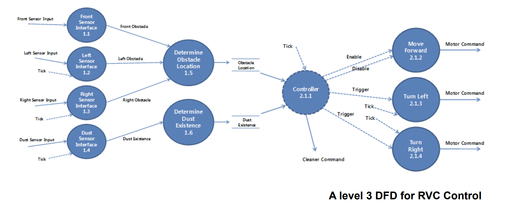

### `An SASD Example - RVC Control(Remote Vehicle Control)`

- 구조적 분석(Structured Analysis)
  1. `데이터 흐름 다이어그램 (DFD)`: RVC 시스템의 구조적 분석에서는 `데이터 흐름 다이어그램을 사용하여 시스템에서 데이터가 어떻게 움직이는지 시각화 한다.` 예를 들어, 사용자 명령이 원격 차량으로 전송되고, 차량의 상태 데이터가 시스템으로 다시 피드백되는 과정을 나타낼 수 있다. 이러한 DFD는 시스템의 각 구성 요소가 데이터를 어떻게 받고 처리하며, 결과를 어떻게 출력하는지 명확하게 보여준다.
  2. `요구 사항 정의`: `사용자의 요구와 시스템의 필요성을 분석하여, RVC 시스템이 수행해야 할 구체적인 기능들을 명시`한다. 이는 차량의 원격 제어를 위한 기능들, 예를 들어 차량 시동, 문 잠금 해제, 위치 추적 등을 포함할 수 있습니다.
  3. `기능 분해`: `복잡한 시스템 기능을 보다 작고 관리 가능한 부분으로 나누어 세분화`한다. 각 부분은 특정한 작업을 수행하며, 전체적인 시스템의 효율적인 기능 수행에 기여한다.
- 구조적 설계(Structured Design)
  1. `모듈화`: `구조적 설계에서는 시스템을 여러 개의 모듈로 나눈다. 각 모듈은 특정한 기능을 수행하며, RVC 시스템의 경우, 예를 들어 '차량 제어 모듈', '사용자 인터페이스 모듈', '데이터 처리 모듈' 등으로 나눌 수 있다.` 이러한 분할은 시스템의 복잡성을 줄이고, 관리 및 유지보수를 용이하게 한다.
  2. `상위 설계 (High-Level Design)`: `모듈 간의 상호 작용과 인터페이스를 설계`한다. 이 과정에서 각 모듈의 입력과 출력, 모듈 간 데이터 전송 방식을 정의한다.
  3. `하위 설계 (Low-Level Design)`: `각 모듈 내부의 세부적인 작업을 설계`한다. 이 단계에서는 모듈 내에서의 함수와 알고리즘을 개발하여 각 기능이 구체적으로 어떻게 실행될지 결정한다.
  4. `유한 상태 기계 (FSM)`: `RVC 시스템의 제어 로직을 설계하는 데 유한 상태 기계를 사용할 수 있다.` 예를 들어, 차량의 다양한 운영 상태(시동, 주행, 대기 등)를 정의하고, 각 상태에 따른 행동과 상태 전환 조건을 설계한다.

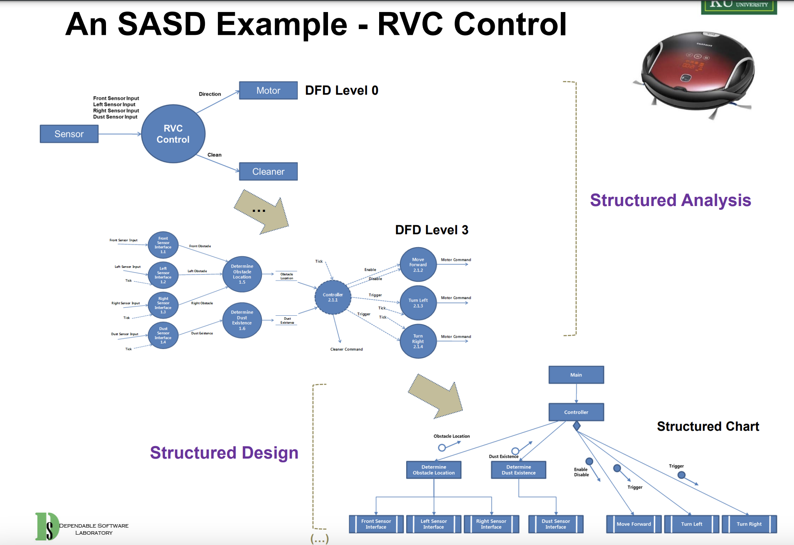

- 이 그림은 RVC(Remote Vehicle Control) 시스템에 대한 SASD(Structured Analysis and System Design)의 구조적 분석과 구조적 설계를 보여주는 예제
- `구조적 분석(Structured Analysis) 부분`:
  - `DFD Level 0`: 이 초기 단계의 데이터 흐름 다이어그램(DFD)에서는 RVC 시스템의 가장 높은 수준의 기능을 보여준다. 여기에는 센서로부터 입력을 받고, 모터를 통해 차량을 제어하며, 청소 장치를 조작하는 기능이 포함.
  - `DFD Level 3`: 더 상세한 데이터 흐름 다이어그램은 시스템 내부의 구체적인 프로세스들을 나타낸다. 예를 들어, 여기에는 위치 결정, 장애물과 먼지 감지, 그리고 모터 명령을 포함한 구체적인 데이터 흐름이 표시.
- `구조적 설계(Structured Design) 부분`:
  - `Structured Chart`: 이 구조화된 차트는 RVC 시스템의 모듈화된 설계를 보여준다. 여기서 메인 컨트롤러는 센서 인터페이스, 움직임 제어 등과 같은 여러 하위 시스템을 관리한다. 이 차트는 각 모듈 간의 관계와 통신을 나타내며, 시스템이 어떻게 통합되어 작동하는지를 보여준다.
- 각 구성 요소는 다음과 같은 역할 수행
  - 센서: 차량 주변의 정보를 수집하고 RVC 시스템에 전달
  - 컨트롤러: 센서 데이터를 기반으로 하여 차량을 어떻게 제어할지 결정
  - 모터: 컨트롤러의 명령에 따라 차량의 물리적 움직임을 조절
  - 청소기: 차량이 청소를 수행하는 데 필요한 기능을 관리

> 이 시스템은 분석 단계에서 정의된 요구 사항에 따라 설계되었으며, 각 컴포넌트의 상세한 작업이 구조적 설계를 통해 구현된다.  구조적 분석은 시스템이 해결해야 할 문제를 이해하는 데 필요한 정보를 제공하고, 구조적 설계는 이러한 문제를 해결하기 위한 시스템의 구조를 정의한다.

## Object-Oriented Programming

객체지향 프로그래밍에서는 프로그램이 객체들로 구성된다.  
이러한 접근 방식은 객체들과 그들 사이의 커뮤니케이션에 중점을 둔다.

### `Concept`

- `객체(Object)` : 데이터와 함수(메서드, operation)로로 구성된다. 객체 내 데이터는 해당 객체의 상태를 나타내며, 함수는 그 데이터를 처리하거나 다루는 행동을 정의한다.
- `객체 통신(Object communication)` : 하나의 객체가 다른 객체의 연산을 호출할 때 그 객체의 메서드를 사용한다.
- `객체 통신을 통한 시스템 기능 제공` : 이 방식에서는 explicit data flow 대신, 객체 간의 commuication sequences만 존재한다.

> Method는 operation의 프로그래밍에서의 구현체이다.

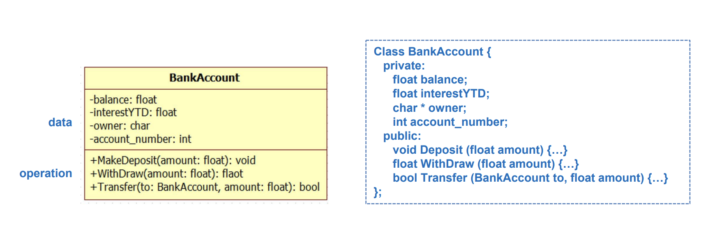
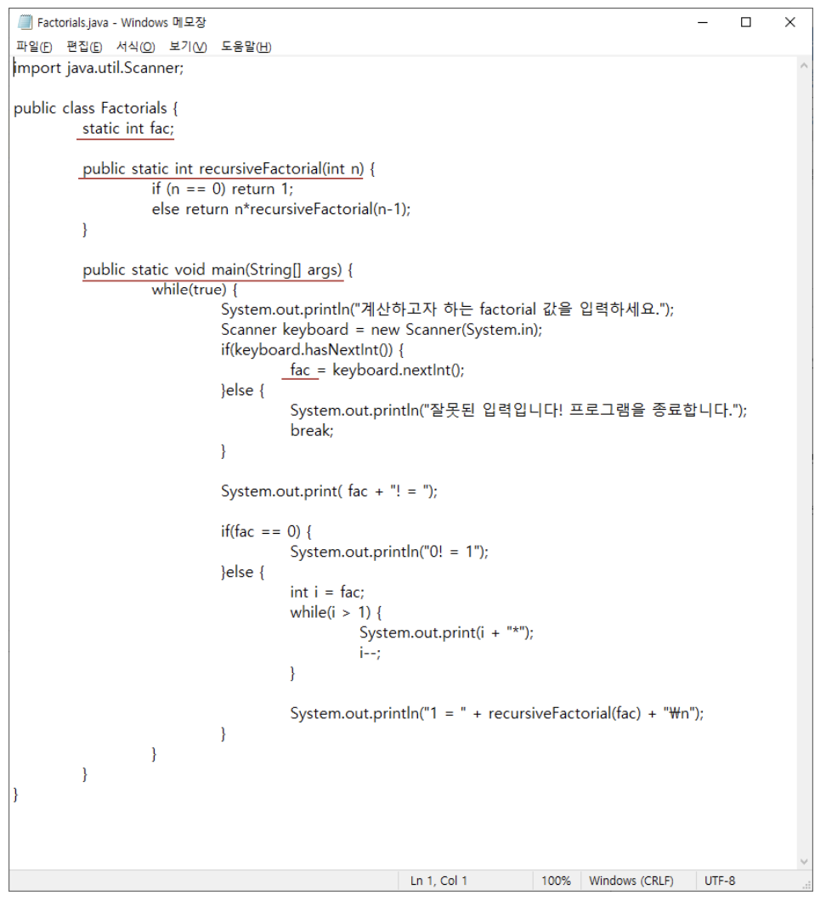

> 객체지향 프로그래밍은 코드의 재사용성, 확장성, 유지보수성을 높이는 데 유리하며, 실제 세계의 사물이나 개념을 프로그래밍에 직관적으로 반영할 수 있게 해준다.

### `OOAD`
- OOAD(Object-Oriented Analysis and Design, 객체지향 분석 및 설계)는 객체지향 프로그램을 위한 소프트웨어 개발 방법론
- OOAD는 두 가지 주요 구성 요소, 즉 OOA(객체지향 분석)와 OOD(객체지향 설계)로 나누어진다.
  - `객체지향 분석 (OOA)`
    - 객체지향 분석은 문제 영역(domain) 내의 개념이나 객체를 발견하고 이해하는 과정
    - 이 단계에서는 시스템이 해결해야 할 실제 세계의 문제를 모델링하고, 필요한 객체들과 그 객체들의 속성, 기능을 식별
    - 예를 들어, 은행 시스템을 개발한다고 할 때, 고객, 계좌, 트랜잭션 등이 객체가 될 수 있다.
    - 이 과정은 시스템이 어떤 것을 해야 하는지(What)를 정의하는 것에 초점을 맞춘다.
  - `객체지향 설계 (OOD)`
    - 객체지향 설계는 OOA에서 식별된 객체들을 소프트웨어 상에서 구현하기 위한 구조를 정의하는 과정
    - 여기서는 객체들의 정적인 부분(속성, 클래스, 상속 등)을 정의하고, 객체들이 어떻게 상호작용하여 요구사항을 충족시킬 것인지(동적인 부분)에 대해 설계
    - 예를 들어, 객체들 사이의 메서드 호출, 이벤트, 데이터 흐름 등을 구체화한다.
    - 이 단계는 시스템이 어떻게 작동할 것인지(How)를 설계하는 것

### `An OOAD Example - Dice Game`

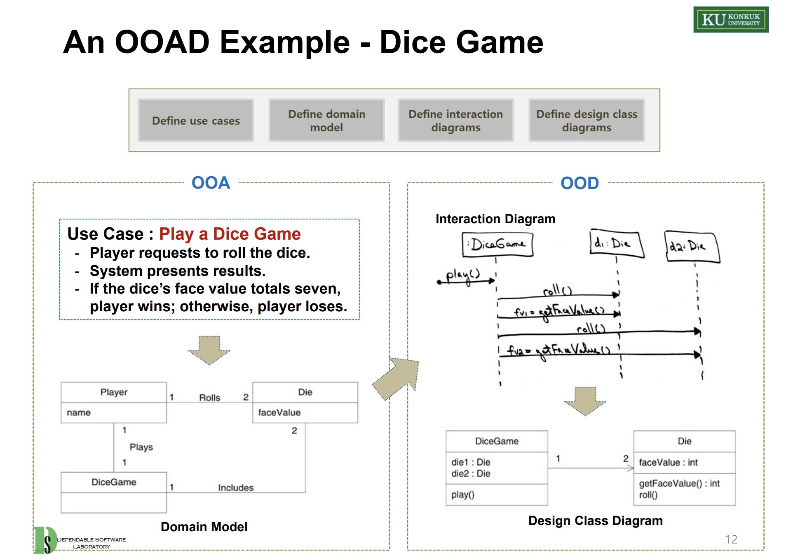

- OOA
  - Use Case: "주사위 게임 하기"로 정의되어 있으며, 플레이어가 주사위를 굴리도록 요청하고, 시스템은 결과를 제시한다. 주사위 면의 합계가 일곱이면 플레이어가 승리하고, 그렇지 않으면 패배한다.
  - 도메인 모델: 이 모델은 실제 게임에서 사용되는 객체들과 그 관계를 나타낸다. 여기에는 플레이어와 주사위(Die) 개체가 포함되어 있으며, 주사위 게임(DiceGame)을 통해 연결된다.
- OOD
  - Interaction Diagram: 주사위 게임의 작동 과정을 시퀀스 다이어그램으로 나타내며, 플레이어가 'play' 메소드를 호출하고 주사위를 두 번 굴리는 과정이 순차적으로 표현되었다.
  - 디자인 클래스 다이어그램: 게임의 각 클래스와 그 속성, 메서드를 보여주는 다이어그램이다. 'DiceGame' 클래스는 두 개의 'Die' 개체를 가지고 있고, 각 주사위는 'faceValue' 속성과 'getFaceValue', 'roll' 메소드를 가지고 있다.

## Software Process Model (소프트웨어 공정 모델)
- 정의 : 소프트웨어 개발을 위한 일련의 체계적 활동, 작업, 이정표, 산출물을 정의하는 절차
- 목적 : 고품질의 소프트웨어를 체계적으로 개발하기 위함
- 구성 요소 : 누가(Who) 무엇을(What) 언제(When) 어떻게(How) 일을 할지를 명확히 한다.
- SDLC(Software Development Life-Cycle)와의 연관성 : 소프트웨어 개발 생명주기를 기반으로 하는 모델로서, 개발의 모든 단계를 포함
  - SDLC의 단계
    1. 요구사항 분석(Requirement Analysis)
    2. 시스템 설계(System Design)
    3. 구현(Implementation)
    4. 테스팅(Testing)
    5. 배포(Deployment)
    6. 유지보수(Maintenance)

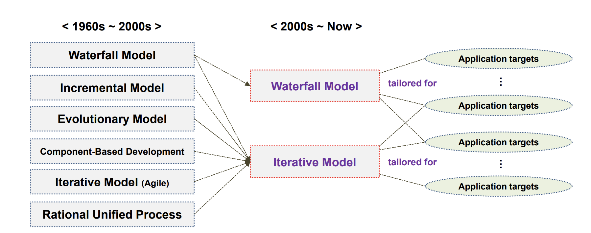

- 역사적 모델 (1960년대 ~ 2000년대) : 
  - Waterfall Model : 순차적인 단계를 따르는 모델로, 하나의 단계가 완료되어야 다음 단계로 진행할 수 있다.
  - Incremental Model : 전체 시스템을 작은 단위로 나누어 점진적으로 개발
  - Evolutionary Model: 사용자의 피드백을 바탕으로 시스템을 지속적으로 개선
  - Component-Based Development : 재사용 가능한 구성 요소를 사용하여 시스템을 구축
  - Iterative Model : 시스템을 반복적으로 개선하며 점진적으로 발전시킨다.
  - RUP(Rational Unified Process): 반복적인 개발에 초점을 맞춘 프레임워크로, 각 반복마다 산출물을 생성한다.
- 현대적 모델 (000년대 ~ 현재) : 
  - 맞춤형 폭포수 모델(Tailored Waterfall Model): 기존 폭포수 모델을 특정 프로젝트 요구사항에 맞게 조정
  - 맞춤형 반복 모델(Tailored Iterative Model): 반복 모델을 프로젝트의 목적과 요구에 맞추어 조정

## Waterfall Model
- 소프트웨어 개발 생명주기(SDLC)의 전통적인 접근 방식
- 이 모델은 체계적이고 순차적인 방법으로 소프트웨어 개발 과정을 진행하는 것을 제안
- 이 방식은 요구사항이 빠르게 확정되고, 작업이 선형적으로 진행되어야 할 때 유용

> 선형적으로 진행된다는 것은 작업들이 일렬로 이어지는 것을 의미한다.  
> Waterfall Model에서는 하나의 단계가 완료되어야 다음 단계로 넘어갈 수 있다. 즉, 모든 과정이 순차적으로 이루어지며, 각 단계는 시작과 끝이 명확하다. 
> 예를 들어, 집을 짓는 과정을 생각해 보자. 먼저 기초를 다지고, 그 다음 벽을 세우며, 그 후에 지붕을 올리는 식이다. 각 단계는 이전 작업이 완전히 마무리되어야만 다음으로 넘어갈 수 있다. 만약 기초 작업이 완료되지 않았다면 벽을 세울 수 없다.  
> 소프트웨어 개발에서도 마찬가지로 요구사항 분석이 완전히 마무리되어야 시스템 설계를 시작할 수 있고, 설계가 완료되어야 코드 작성으로 넘어갈 수 있다. 각 단계가 마치 계단을 하나씩 올라가는 것처럼 연속적이고 구조적으로 진행된다. 
> 이런 방식은 변경 사항이 적고, 시작부터 끝까지 명확하게 계획할 수 있는 프로젝트에서 특히 유용하다. 이미 프로젝트의 모든 요구사항이 정해져 있고, 중간에 크게 변하지 않을 것으로 예상될 때 이 모델을 사용하면 효과적이다.

- 주요 단계
  1. `요구사항 분석(Requirement Analysis)`: 프로젝트의 `요구사항을 수집하고 분석하는 단계`. 이 단계에서 소프트웨어가 해결해야 할 문제와 사용자의 필요를 명확히 한다.
  2. `시스템 설계(System Design)`: 분석 단계에서 정의된 요구사항을 바탕으로 시스템의 `구조를 설계`. 여기에는 소프트웨어의 아키텍처, 데이터 구조, 인터페이스, 알고리즘 등이 포함.
  3. `구현(Implementation)`: 설계 단계에서 정의된 디자인을 `실제 코드로 변환`하는 과정. 개발자들이 프로그래밍 언어를 사용하여 소프트웨어의 구성 요소를 개발.
  4. `시스템 테스팅(System Testing)`: `완성된 소프트웨어가 요구사항을 만족하는지 검증`합니다. 이 단계에서는 버그를 찾아내고 수정한다.
  5. `시스템 배포(System Deployment)`: `테스트를 거친 소프트웨어를 사용자 환경에 배포`합니다. 이는 소프트웨어가 실제 운영될 준비가 되었음을 의미합니다.
  6. `시스템 유지보수(System Maintenance)`: `배포된 소프트웨어의 지속적인 지원과 개선 작업을 수행`한다. 유지보수는 소프트웨어를 최신 상태로 유지하고, 새로운 요구사항이나 문제가 발생했을 때 이를 처리한다.

## Iterative Model - Agile
- 애자일 개발은 소프트웨어 개발 방법론들을 포괄하는 용어로, 빠른 프로토타이핑과 빠른 개발 경험을 중시한다. 
- 이는 문서화와 프로세스 명세에 있어서 가벼운 접근을 취하며, 예를 들어 XP(익스트림 프로그래밍), TDD(테스트 주도 개발)와 같은 방법론이 포함된다.
- 애자일 방법론의 특징
  1. Iterative : 여러 개의 사이클로 개발이 이루어짐
  2. Incremental : 제품을 한 번에 전달하지 않고 점진적으로 개발
  3. 사용자 참여 : 사용자를 적극적으로 개발 과정에 참여시켜 요구사항을 확립
- 애자일 방법론은 다음과 같은 가치들을 중시
  1. 사람 간의 직접적인 커뮤니케이션이 프로젝트의 성공에 있어서 엄격한 프로세스나 복잡한 도구 사용보다 더 중요하다. 즉, 좋은 팀워크와 원활한 인간 관계가 프로젝트 관리 도구나 엄격한 작업 절차를 따르는 것보다 프로젝트를 성공으로 이끄는 데 더 큰 영향을 미친다는 관점이다.
  2. 완벽하고 상세한 문서 작업에 시간을 소비하기보다는 실제로 작동하는 소프트웨어 제품을 개발하는 데 집중해야 한다.
  3. 고객과의 지속적인 협력을 통해 최종 제품을 함께 만들어가는 과정을 더 중요하게 여긴다. 즉, 개발 과정에서 변화하는 고객의 필요와 피드백을 반영하여 제품을 지속적으로 조정하고 개선하는 것을 선호한다는 관점이다.
  4. 개발 과정 중에 계획의 변경이 필요할 때 유연하게 대응하며 적응해야 한다.

> 이런 특성 덕분에 애자일 모델은 빠르게 변화하는 요구사항에 효과적으로 대응할 수 있으며, 개발 과정을 통해 지속적으로 고객의 피드백을 반영할 수 있다.

## Iterative Model - UP
- UP, 즉 Rational Unified Process는 반복적이고 점진적인 소프트웨어 개발을 위한 프레임워크 
- 이 방법론은 반복적인 접근을 통해 소프트웨어를 개발하며, 각 반복은 a small waterfall cycle를 포함
- UP는 Risk-driven한 접근법을 취하며 고객의 요구와 아키텍처에 초점을 맞추고, 유스케이스(사용 사례)를 중심으로 개발을 진행한다.

> 'Risk-driven' 즉, 위험 주도적인 접근법을 취한다는 것은 개발 과정에서 발생할 수 있는 잠재적인 위험 요소들을 빠르게 식별하고, 이를 관리 및 해결하는 데 초점을 맞춘다는 의미

> '고객의 요구와 아키텍처에 초점을 맞춘다'의 의미는 고객의 필요와 요구사항이 소프트웨어 개발의 중심에 있어야 하며, 소프트웨어의 기본 구조나 설계가 이러한 요구를 충족시키도록 구축되어야 한다는 것이다. 아키텍처가 견고하면 나머지 개발 과정이 더 원활하게 진행될 수 있기 때문에, 초기 단계에서 이를 확립하는 것이 중요하다.

> '유스케이스 중심으로 개발을 진행한다'는 말은 실제 사용자의 시나리오를 기반으로 시스템이 어떻게 작동해야 하는지를 정의하는 사용 사례를 개발 과정의 핵심으로 삼는다는 의미이다. 유스케이스를 통해 개발자들은 사용자가 시스템과 상호작용하는 구체적인 방법을 이해할 수 있으며, 이것은 개발하는 소프트웨어가 실제로 사용될 때의 상황을 반영하는 데 도움이 됩니다.

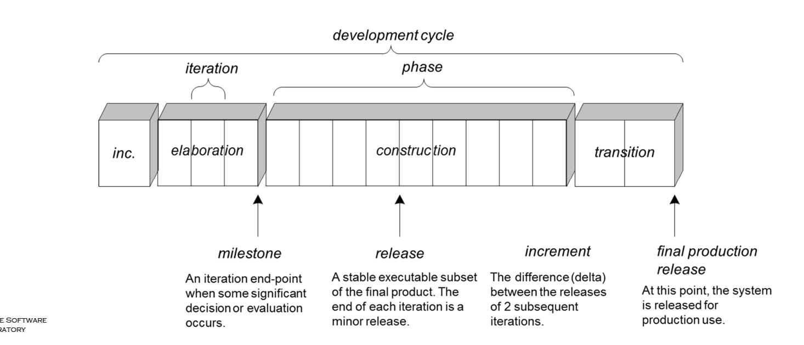

- UP의 4가지 단계
  1. 시작(Inception): 프로젝트의 기본 아이디어를 정의하고, 초기 비용과 일정을 추정하며, 프로젝트의 타당성을 평가한다.
  2. 정제(Elaboration): 프로젝트의 요구사항을 더욱 상세히 정의하고, 아키텍처의 기반을 구축한다.
  3. 구축(Construction): 실제 소프트웨어 제품을 개발하고, 사용자에게 제공할 준비를 한다.
  4. 전환(Transition): 소프트웨어를 사용자 환경으로 이전하고, 최종 사용자에게 배포한다.

> UP가 객체지향 소프트웨어 개발에 적합한 이유는, 이 프로세스가 체계적인 접근을 제공하며, 반복적인 개발을 통해 위험을 조기에 식별하고 최소화할 수 있기 때문이다. 즉, 프로젝트가 진행될수록 프로젝트 팀은 점점 더 많은 정보를 얻고, 이를 바탕으로 위험을 관리하며, 고객의 피드백을 받아들이고 반영할 수 있다. 이 과정을 통해 소프트웨어는 고객의 기대에 부합하도록 지속적으로 발전할 수 있다.  
> 각 반복(iteration)은 이러한 분야들을 통해 소프트웨어를 점진적으로 발전시키며, 반복마다 중요한 기능을 추가하거나 개선한다. 최종적으로, 이 프로세스는 프로젝트의 위험을 줄이고, 고객이 원하는 가치를 제공하는데 중점을 두고 있다.

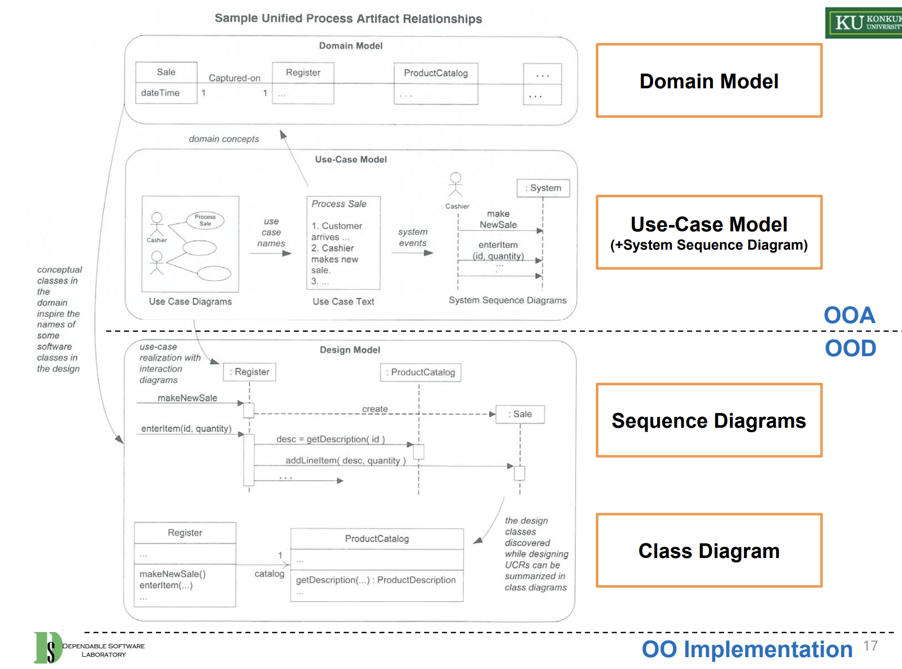

이 그림은 UP 기반의 객체지향 분석 및 설계(OOAD) 과정의 일부를 나타낸다. 여기에는 도메인 모델, 유스케이스 모델(시스템 시퀀스 다이어그램 포함), 시퀀스 다이어그램, 그리고 클래스 다이어그램의 관계와 흐름이 나와 있다.

- 도메인 모델(Domain Model): `시스템의 주요 개념을 나타내는 클래스들과 그 관계`를 보여준다. 이 모델은 시스템이 어떤 정보를 다뤄야 하는지를 개념적으로 정의한다.
- 유스케이스 모델(Use-Case Model): 사용자의 시나리오를 나타내며, `시스템이 수행해야 할 작업을 설명`한다. 유스케이스 다이어그램과 함께 각 유스케이스의 상세한 텍스트 설명이 포함될 수 있다.
- 시스템 시퀀스 다이어그램(System Sequence Diagram): 유스케이스 모델의 한 부분으로, 시스템의 작동 순서를 단계별로 나타낸다. `이는 사용자 요청에 따른 시스템의 반응을 시각적으로 표현`한다.
- 시퀀스 다이어그램(Sequence Diagrams): 객체 간의 상호 작용과 시간에 따른 정보 흐름을 보여주며, 메시지 교환을 통해 시스템의 동작을 나타낸다.
- 클래스 다이어그램(Class Diagram): 유스케이스를 실현하기 위해 필요한 시스템의 구조를 보여준다. 여기에는 클래스들, 그들의 속성, 메소드, 그리고 클래스들 사이의 관계가 포함한다.

## 결론

- 절차지향, 객체지향의 차이
  - 절차지향 프로그래밍 : 이는 프로그램을 기능 또는 동작의 순서로 보는 방식이다. 프로그램은 일련의 절차나 루틴으로 구성되며, 중점은 문제를 어떻게 해결할지에 대한 단계별 접근에 있다. 데이터와 함수가 분리되어 있고, 데이터가 전역적으로 접근 가능하거나 함수에 의해 전달되는 형태를 띈다.
  - 객체지향 프로그래밍: 객체지향 프로그래밍은 데이터와 함수를 객체라는 단위로 묶어 접근한다. 여기서 중점은 데이터를 중심으로 하고, 데이터를 객체의 상태로 보며, 객체는 데이터와 이를 조작할 수 있는 메서드를 함께 캡슐화한다. 이 접근법은 코드의 재사용성과 유지보수를 용이하게 하며, 실세계의 개념과 행위를 모델링하기에 적합하다.

- Software Process Model, Waterfall Model, Agile, 과 UP에 대한 설명
  - 설명한 이유는 객체지향 개발 방법론을 이해하기 위한 기초를 제공하기 위함이다. 각 모델은 객체지향 소프트웨어를 개발하는 데 있어 다양한 접근 방식과 철학을 대표한다.
  - Software Process Model은 소프트웨어 개발의 다양한 접근법을 이해하는 데 도움을 준다.
  - Waterfall Model은 초기 소프트웨어 개발의 단순하고 순차적인 접근을 나타낸다.
  - Agile은 변화에 민첩하게 대응하고 지속적인 고객 피드백을 반영하는 현대적인 접근 방식을 제시한다.
  - UP (Unified Process) 및 RUP (Rational Unified Process)는 반복적이고 점진적인 개발을 강조하는 구체적인 프레임워크로, 객체지향 설계의 복잡성을 관리하기 위한 구조를 제공한다.

> 이러한 개념들은 객체지향 개발 방법론을 이해하기 위한 중요한 배경 지식을 형성한다.  
> 객체지향 개발 방법론의 정의는 '소프트웨어를 개발하는 과정에서 데이터와 행위를 하나의 단위인 객체로 취급하고, 이러한 객체들이 메시지를 통해 상호작용하며 사용자의 요구사항을 충족시키는 방식'으로 요약할 수 있다.  
> 객체지향 방법론은 재사용성, 확장성, 그리고 유지보수의 용이성에 초점을 맞추며, 프로그램을 보다 유연하게 만들어 실세계의 다양한 문제를 해결할 수 있도록 한다.