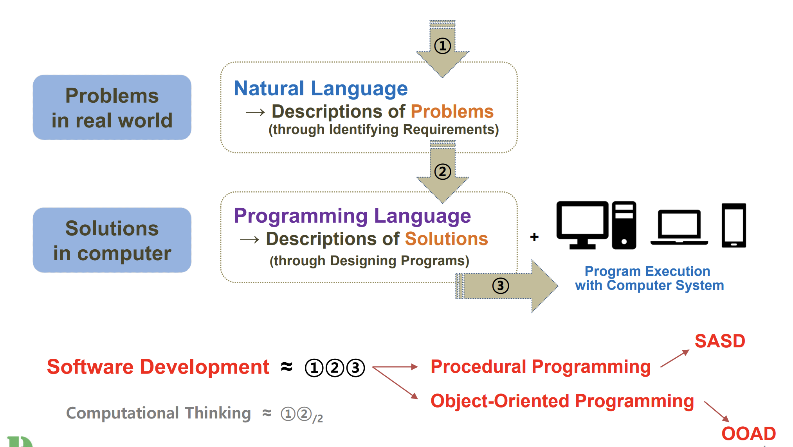
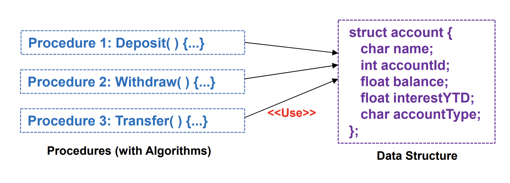
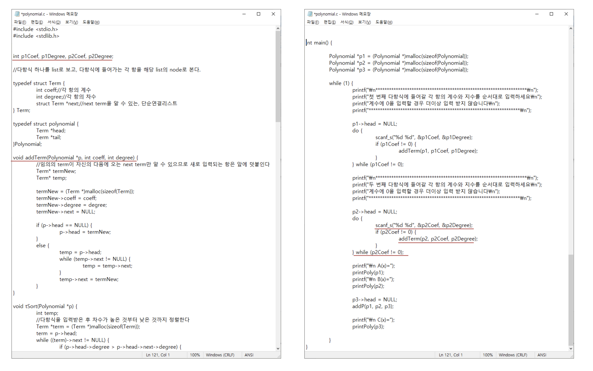

# Software Development

## Software Development

- 소프트웨어 개발은 컴퓨터에서 소프트웨어로 문제를 해결하는 것과 유사하다.
  - 현실에서의 문제 : 자연어 -> 요구사항 인식을 통한 문제의 정의 + Business Process
  - 컴퓨터에서의 해결방안 : 프로그래밍 언어 -> 프로그램 설계를 통한 문제해결 정의 + 컴퓨터 시스템으로 프로그램 실행

> 현실에서의 문제와 컴퓨터에서의 해결방안 사이에는 언어간에 큰차이가 존재한다.

- 소프트웨어 개발은 다음 3단계로 정의할 수 있다.
  1. `자연어를 통한 현실세계의 문제 정의`: 이 단계는 문제의 이해와 분석을 포함한다. 여기서 자연어는 문제의 본질을 파악하고 요구사항을 정의하는 데 사용. 이 과정에서 비즈니스 프로세스 분석이 중요한 역할을 한다.
  2. `프로그래밍 언어를 통한 컴퓨터를 통한 해결방안 정의`: 이 단계에서는 문제 해결을 위한 알고리즘과 데이터 구조를 설계. 이는 프로그래밍 언어를 사용하여 구체적인 해결책을 정의하는 과정을 포함.
  3. `컴퓨터 시스템에서 프로그램 실행`: 여기서는 개발된 프로그램이 실제 컴퓨터 시스템에서 실행되어 결과 생성. 이 단계는 테스트 및 유지보수도 포함할 수 있다.

- 이러한 소프트웨어 개발에 필요한 프로그래밍을 두 가지로 생각할 수 있다.
  - Procedural Programming - (SASD)
  - Object-Oriented Programming - (OOAD)

## Procedural Programming

- 절차적 프로그래밍 : 이는 프로그램을 일련의 절차나 루틴(함수)으로 구성하는 방법론. 프로그램의 흐름은 순차적으로 진행되며, 데이터 처리를 위한 명령어들이 순서대로 실행.
  - Procedure / Function
    - 절차적 프로그래밍에서 함수나 절차는 프로그램의 빌딩 블록 역할
    - 이들은 특정 작업을 수행하기 위한 일련의 명령문(statement)을 포함하며, 변수의 값을 변경할 수 있다.
  - 자료구조와 알고리즘: 절차적 프로그래밍은 자료구조와 알고리즘에 큰 중점을 둔다.
    - 알고리즘(Algorithm): 문제 해결을 위한 명령어의 집합으로, 프로그램이 어떻게 동작해야 하는지를 정의 - 제어 중심(Control-Centric)
    - 자료구조(Data Structure): 데이터를 조직, 관리, 저장하기 위한 구조 - 데이터 중심(Data-Centric)
  - FORTRAN과 C는 절차 지향적 프로그래밍 언어의 대표적인 예. 이 언어들은 프로그램을 작업을 수행하는 함수의 집합으로 구성하며, 이 함수들은 데이터를 처리하고 결과를 반환

