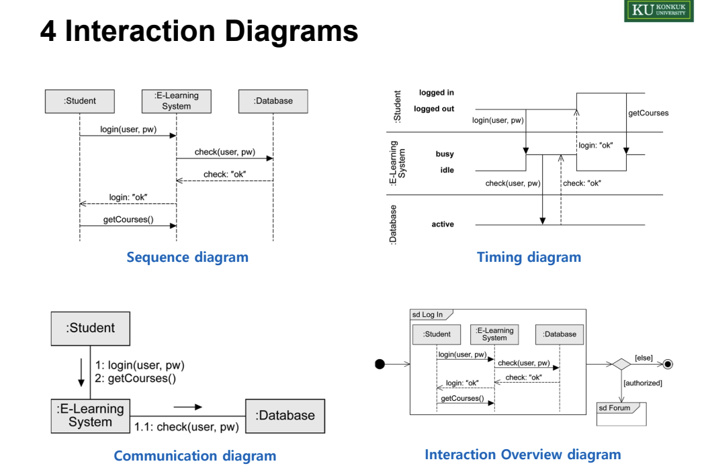
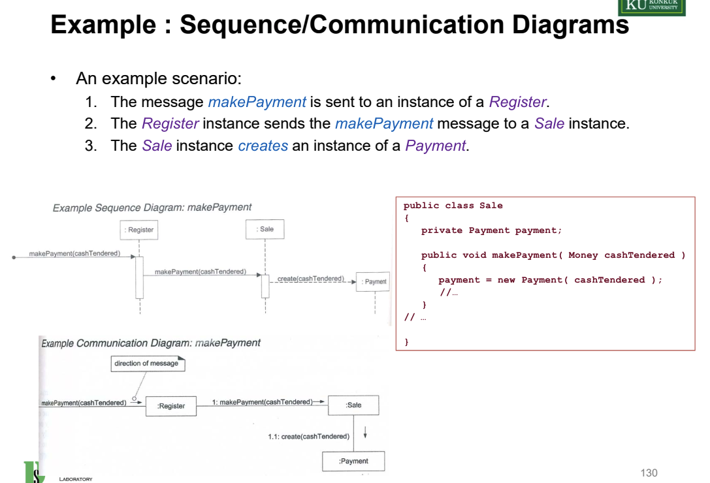
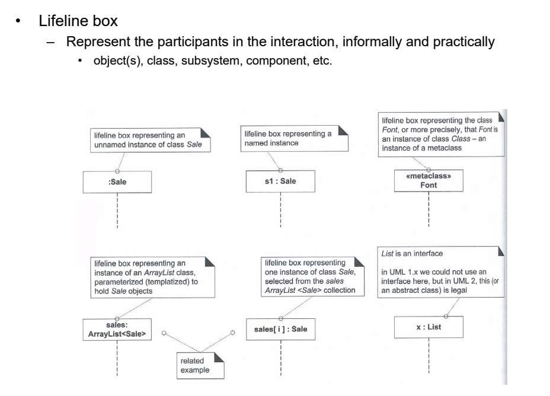
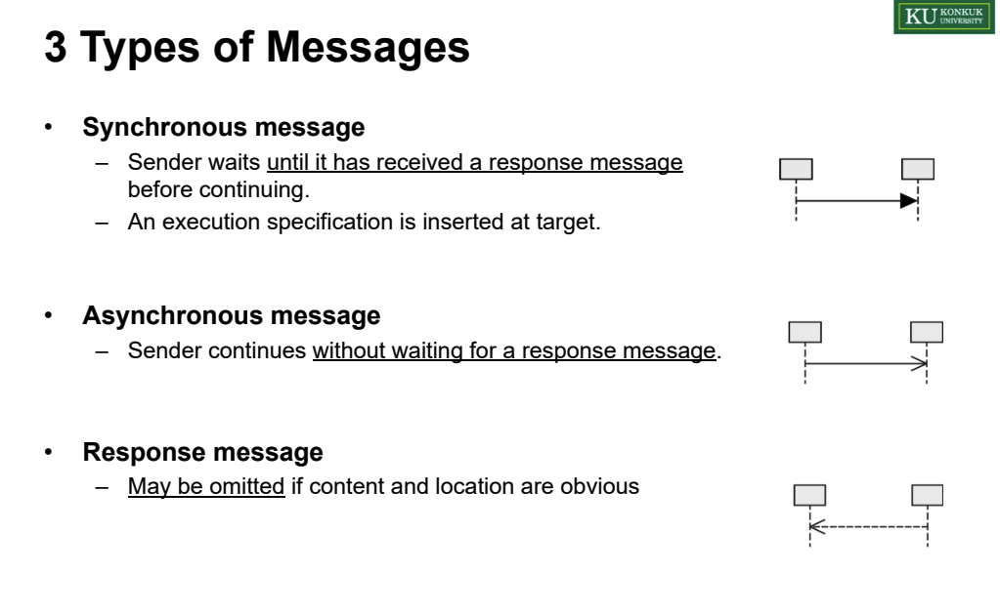
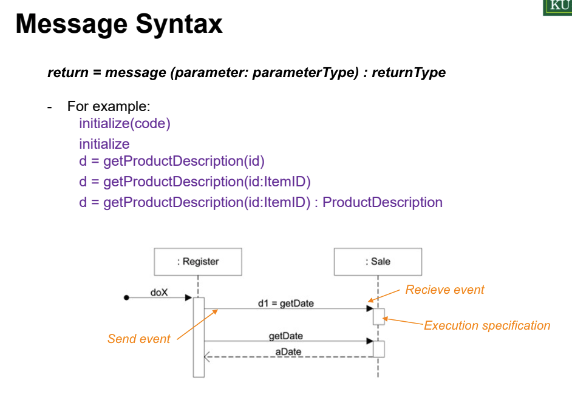

# Chapter 15. UML Interaction Diagrams

## Interaction Diagram이란
- 인터렉션 다이어그램이란 객체들이 메세지를 통해 어떻게 상호작용하는지를 시각화한 다이어그램이다.
- Interaction Diagram에는 4가지 종류가 있다.

- 시퀀스 다이어그램 : 시간 순서를 기반으로 하여 객체들 사이의 상호작용을 나타냄
- 커뮤니케이션 다이어그램 : 시간의 순서보다 객체들의 상호작용을 보여주는데 초점을 맞춤

## 알아두면 좋을 시퀀스 다이어그램 문법들

