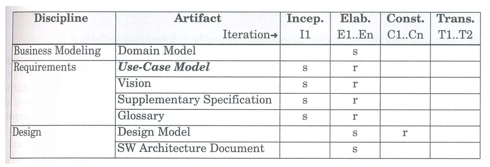

# Chapter 7. Other Requirements

## Other Requirements Artifacts

- Supplementary Specification ( 보충 사양 ) 
  - 기능적 요구사항 외의 다른 유형의 요구사항을 포착하고 식별한다.
  - 이는 보고서, 문서화, 포장, 지원 가능성, 라이선스 등과 같은 요소를 포함한다.

- Glossary (용어집)
  - 프로젝트에 사용되는 용어와 정의를 모아놓은 데이터 사전
  - 이를 통해 모든 팀원이 동일한 용어를 일관된 방식으로 이해하고 사용할 수 있도록 도와준다.

- Vision 
  - 프로젝트의 전반적인 '비전'을 요약한 문서
  - 주로 Executive Summary (전체 내용을 간략하게 요약한 섹션) 형태로 작성된다.
  - 프로젝트의 주요 목표와 기대 결과를 나타낸다.

- Business Rules
  - 오랫동안 지속되고 범용적인 규칙이나 정책을 담은 문서
  - 특정 애플리케이션에만 국한되지 않고 넓은 범위에서 적용되는 것들 (예 : 세법)


## Supplementary Specification

- Supplementary Specification은 Glossary나 Use Case에서 쉽게 다룰 수 없는 요구사항, 정보, 제약 조건들을 포함한다.
- 이는 시스템 전체에 걸친 "FURPS+" 품질 속성을 포함한 다양한 요소들을 명시하는데 사용된다.
- 포함될 수 있는 요소들은 다음과 같다.
  ```
  기능적이고 비기능적 요구사항
  보고서
  하드웨어 및 소프트웨어의 제약 조건
  개발 제약 조건
  다른 설계 및 구현 제약 조건
  국제화에 대한 고려사항(단위, 언어 등)
  문서화(사용자, 설치, 관리 문서) 및 도움말
  라이센싱 및 기타 법적 고려사항
  packaging
  기술, 안전, 품질과 관련된 표준
  물리적 환경에 대한 고려사항(예: 열이나 진동)
  운영상의 고려사항(예: 오류 처리 방법, 백업 빈도)
  애플리케이션 특정 도메인 규칙
  관심 도메인의 정보(예: 신용 결제 전체 주기는 어떻게 처리되는지)
  ```

## Process: Evolutionary Requirements in Iterative Methods



- 다시 이 그림을 보자.
- 여기서 설명했던 Other Requirements도 Inception단계에서 시작되어 Elaboration단계에서 더 정제되고 개선되어야 하는 것을
볼 수 있다.


- UP의 4단계를 다시 한번 되 짚어 보자

  1. Inception : 프로젝트의 범위를 정의하고 기본적인 아이디어를 설정한다. Requirements에 관련된 Artifact가 작성되기 시작하는 단계이다.

  2. Elaboration : 아키텍쳐를 세워서 기능과 비기능적 요구사항을 상세히 분석한다. 이 단계에서 Inception에서 시작된 문서들은 더욱 refine되고 구체화 된다. 그림을 보면 이 단계에서는 Design(설계)과 관련된 Artifact가 시작된다.

  3. Construction : 시스템이 실제로 구축되는 단계로, 이전 단계에서 정의된 아키텍처와 디자인을 기반으로 소프트웨어 개발이 본격적으로 진행된다. 이 단계에서 Design Model이 refine 된다.

  4. Transition : 완성된 시스템을 배포하고 사용자들에게 전달한다. 이 단계는 주로 배포 후 활동에 초점을 맞추고 필요한 경우 일부 문서를 마무리한다.

> UP에서는 반복적인 접근을 통해 각 단계에서 학습하고 발견한 사항을 다음 iteration에 통합하여 프로젝트를 점진적으로 발전시키는 것을 중요하게 여긴다. 그렇기 때문에 아티팩트들이 계속해서 개선되고 정제되는 과정이 이루어진다.


